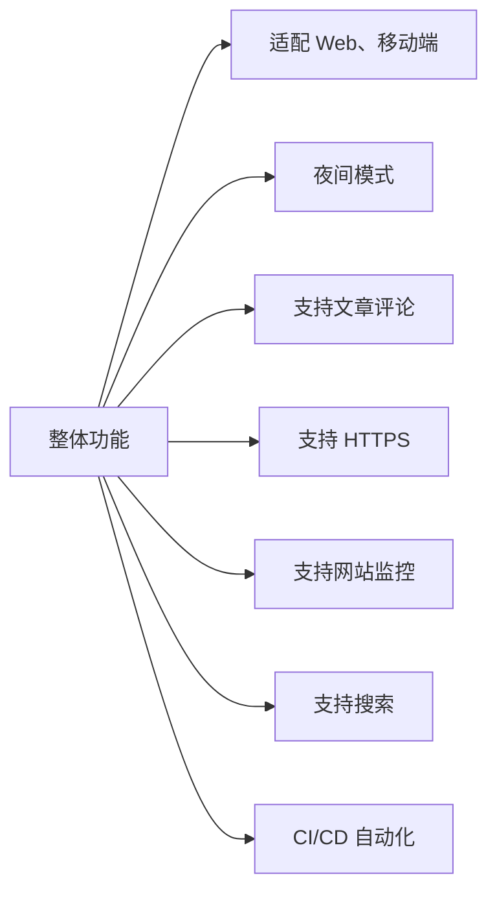

# Ken - 快速搭建你的个人博客网站

基于 Facebook 开源的静态博客生成框架，短时间可完成个人博客网站开发、部署并上线。

## 开发

1. 拉取代码：

```shell
git clone git@github.com:Penggeor/ken.git
```

2. 安装依赖：

```shell
npm install
```

3. 本地运行：

```shell
npm run start
```

访问 `http://localhost:3000` 


## 快速部署

### Vercel

点击下方按钮 👇 快速部署到你的 Vercel 账号上


[](https://vercel.com/new/clone?repository-url=https%3A%2F%2Fgithub.com%2FPenggeor%2Fken)


## 功能




## 技术栈

1. [Docusaurus V3.7](https://docusaurus.io/)： Facebook 开源的博客网站，**名字有点难拼写**，它由 Docu 和 saurus 组合而成，前者是指“文档”，后者是指“蜥蜴”，寓意轻量快捷的文档生成框架。
2. [Giscus](https://giscus.app/)：开源的评论集成工具，直接利用 GitHub Discuss，不用自己维护一个数据库。
3. [Posthog](https://posthog.com/)：开源的网站监控工具。它的 cloud 版本有一百万事件的免费额度。
4. [Nginx](https://www.nginx.com/)：反向代理服务器。
5. [Docker](https://www.docker.com/)：部署网站
6. Algolia：网站内搜索服务，对于开源项目可以免费使用。
7. 又拍云 + uPic：又拍云提供云存储功能，uPic 是一款免费的图片上传应用，两者结合完成图床功能。
8. [UCloud](https://www.ucloud.cn/site/active/kuaijiesale.html?invitation_code=C1xCCE664C27422)：提供服务器、域名、SSL 证书。
10. Github Action：CI/CD 部署

## Feedback

有问题除了 GitHub Issue，也可以通过微信联系：


