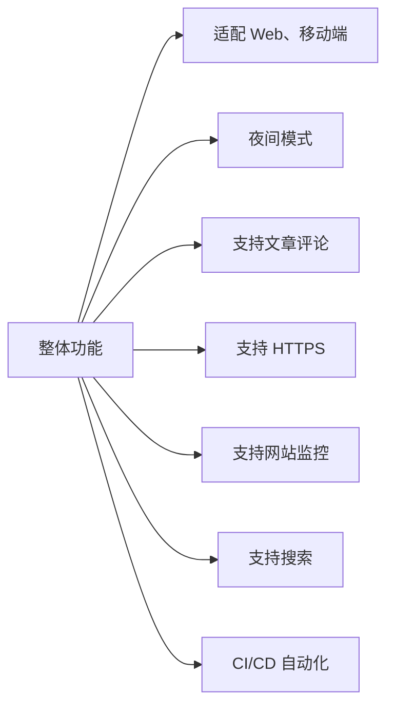

# Ken - 快速搭建你的个人博客网站

基于 Facebook 开源的静态博客生成框架，短时间可完成开发、部署并上线。



技术供应层面上：

1. [Docusaurus V3.7](https://docusaurus.io/)： Facebook 开源的博客网站，**名字有点难拼写**，它由 Docu 和 saurus 组合而成，前者是指“文档”，后者是指“蜥蜴”，寓意轻量快捷的文档生成框架。

   

2. [霞鹭字体](https://github.com/lxgw/LxgwWenKai)：开源的中文字体，非常好看。

   

3. [Giscus](https://giscus.app/)：开源的评论集成工具，直接利用 GitHub Discuss，不用自己维护一个数据库。

4. [Posthog](https://posthog.com/)：开源的网站监控工具。它有 cloud 版本，有一百万事件的免费额度。

5. [Nginx](https://www.nginx.com/)：反向代理服务器。

6. [Docker](https://www.docker.com/)：部署网站

7. Algolia：网站内搜索服务，对于开源项目可以免费使用。

8. 又拍云 + uPic：又拍云提供云存储功能，uPic 是一款免费的图片上传应用，两者结合完成图床功能。

9. UCloud：提供服务器、域名、SSL 证书。

10. Github Action：CI/CD 部署


## 开发

1. 拉去代码到本地

```shell
git clone git@github.com:Penggeor/ken.git
```

2. 安装依赖

```shell
npm install
```

3. 本地运行

```shell
npm run start
```

然后访问 `http://localhost:3000` 即可看到效果。


## 快速部署

### Vercel

点击下方按钮 👇 快速部署到你的 Vercel 账号上


[](https://vercel.com/new/clone?repository-url=https%3A%2F%2Fgithub.com%2FPenggeor%2Fken)