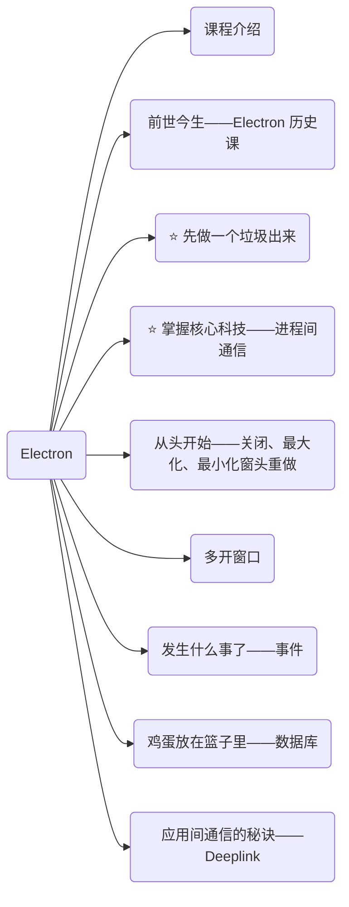

🚧 WIP

进来这门课学习 Electron 的同学，无非是出于自身需求、学习了解，或者公司要求，而这些目的的背后，其实都是想知道——**如何开发一款 PC 客户端的应用**。

这门课当然、必须、肯定要满足这个要求，并且不止步于此。这是当前的课程框架：

```mermaid
graph LR;
    545680b4-26c2-4645-a9cf-30bd5baebd4f(Electron) --> A
    545680b4-26c2-4645-a9cf-30bd5baebd4f-->9f82e5b4-108a-4f24-974f-c0403ebe003b
    545680b4-26c2-4645-a9cf-30bd5baebd4f-->M
    545680b4-26c2-4645-a9cf-30bd5baebd4f-->N
    545680b4-26c2-4645-a9cf-30bd5baebd4f-->O
    545680b4-26c2-4645-a9cf-30bd5baebd4f-->P
    545680b4-26c2-4645-a9cf-30bd5baebd4f-->Q
    545680b4-26c2-4645-a9cf-30bd5baebd4f-->R
    545680b4-26c2-4645-a9cf-30bd5baebd4f-->S
    A(课程介绍)
    9f82e5b4-108a-4f24-974f-c0403ebe003b(前世今生——Electron 历史课)
    M(⭐ 先做一个垃圾出来);
    N(⭐ 掌握核心科技——进程间通信);
    O(从头开始——关闭、最大化、最小化窗头重做);
    P(多开窗口);
    Q(发生什么事了——事件);
    R(鸡蛋放在篮子里——数据库);
    S(应用间通信的秘诀——Deeplink);
```

学习完这门课程，轻松拿捏 Electron，但如果时间有限，可以仅学习标“⭐”的小节。
