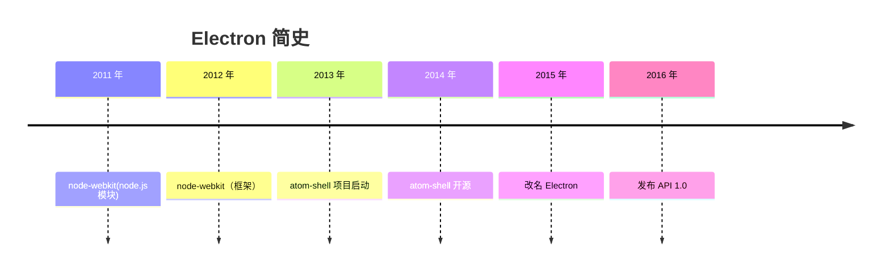

🚧 WIP

Electron 创始人赵成（Cheng Zhao）可能自己都不会想到，这个把浏览器和 Node.js 打包在一起，用来开发客户端的框架会这么火，国外的 VSCode、Figma、Notion、Postman，国内的剪映、飞书、QQ 等等**成千上万的应用，背后都是 Electron**。



故事开始于 2012 年的夏天，当时在上海的英特尔开源技术中心的老王（[Roger Wang 王文睿](https://github.com/rogerwang)）想要招一名[实习生](https://groups.google.com/g/nodejs/c/uPPujFxek7c/m/uUWgQUeQeHcJ)，去维护 [node-webkit](https://github.com/nwjs/nw.js)。node-webkit 是一个将 WebKit 和 Node.js 打包在一起的框架，可以用来开发桌面应用的开源项目。


但 node-webkit 最初并不是用来开发桌面应用，它仅仅只是一个 node.js 模块，可以创建 WebKit 窗口，并在 WebKit 中调用 Node.js 的模块，这看起来有点像 PHP。

Node.js 代码：

```javascript
var nwebkit = require('nwebkit')
nwebkit.init({'url' : 'index.html'}, function () {
  nwebkit.context.runScript('')
})
```

index.html 代码：

```html
<html><body>
<p id="output"></p>
<script>
require('fs').readdir('.', function (err, files) {
  var result = ''
  files.forEach(function (filename) { result += filename + '<br/>' } )
  document.getElementById('output').innerHTML = result
});
</script>
</body></html>
```

赵成饶有兴趣地加入了，进来后发现 node-webkit 一个用户也没有，但这也给了他自由发挥的机会，毕竟搞砸了也没关系。

接手 node-webkit 之后，他发现原有的项目要想将 Chromium 和 Node.js 打包也太难了，于是一整个推倒重写，重写后的 node-webkit 变成了一个可以调用 node.js 的独立浏览器。

再进一步，赵成加入打包系统、完善细节等等，把 node-webkit 打造成了一个可以用 HTML、JavaScript 来开发桌面应用的框架。


> 上图是 node-webkit 的打包架构，来自赵成的 [PPT](https://speakerdeck.com/zcbenz/node-webkit-app-runtime-based-on-chromium-and-node-dot-js?slide=7)

老王很开心，让一个实习生做业务无关的事情，有了产出，对上面有交代了。但赵成开心不起来，虽然此时的 node-webkit 领跑其他同类框架，但还是一个用户都没有。

**用户才是一个开源框架项目生存下去的意义**，想明白这点后，赵成开始了营销之路，主要是这两点：

1. **让 node-webkit 变得易用**：编写测试用例，让用户快速上手；在 GitHub Issue 上修复 Bug Report，回答问题等。
2. **让更多人知道 node-webkit**：使用 Google group，这是一个 Google 提供的在线讨论平台，允许用户创建和参与讨论组，有点类似于在线版的微信群聊，赵成会这里在[发布新版本公告](https://groups.google.com/g/nodejs/c/yFiEUM3TnMs/m/KW9qxv7X0rkJ)，回答问题，和别人争论；参加技术会议，比如 [JSConf China](https://jsconf.cn/) 

> JSConf China 最后一届停留在了疫情前的 2019 年

努力不会说谎，第一个用户 [Chris Granger](https://github.com/ibdknox)，大胆地使用 node-webkit 来开发 [Light Table 编辑器](https://github.com/LightTable/LightTable?tab=readme-ov-file)，这是一个可以实时计算代码结果的 IDE，这为 node-webkit 带来了一波泼天的流量，从此 node-webkit 声名鹊起，走上正轨。


## Reference

https://en.wikipedia.org/wiki/Electron_(software_framework)

https://brainhub.eu/library/what-is-electron-js

https://www.electronjs.org/blog/10-years-of-electron

https://www.zhihu.com/question/36292298/answer/102418523