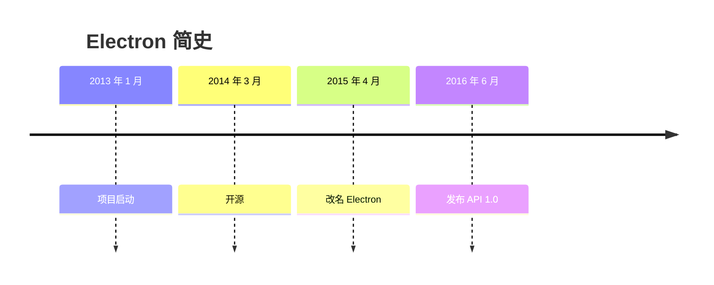

🚧 WIP

Electron 的创始团队可能自己都不会想到，这个把浏览器和 Node.js 打包在一起，用来开发客户端的框架会这么火，国外的 VSCode、Figma、Notion、Postman，国内的剪映、飞书、QQ 等等无数的应用，背后都是 Electron。

时间回到 2013 年 1 月，

Reference

https://en.wikipedia.org/wiki/Electron_(software_framework)

https://brainhub.eu/library/what-is-electron-js

https://www.electronjs.org/blog/10-years-of-electron
