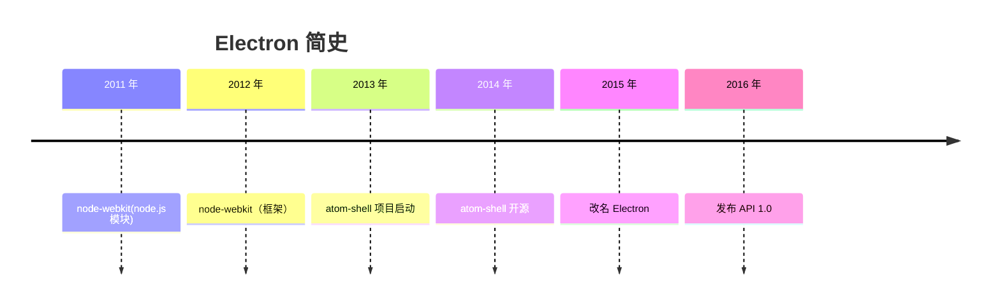

Electron 创始人赵成可能自己都不会想到，这个把浏览器和 Node.js 打包在一起，用来开发客户端的框架会这么火，国外的 VSCode、Figma、Notion、Postman，国内的剪映、飞书、QQ 等等**成千上万的应用，背后都是 Electron**。



故事开始于 2012 年的夏天，当时在上海的英特尔开源技术中心的老王（[Roger Wang 王文睿](https://github.com/rogerwang)）想要招一名[实习生](https://groups.google.com/g/nodejs/c/uPPujFxek7c/m/uUWgQUeQeHcJ)，去维护 [node-webkit](https://github.com/nwjs/nw.js)。node-webkit 是一个将 WebKit 和 Node.js 打包在一起的框架，可以用来开发桌面应用的开源项目。


但 node-webkit 最初并不是用来开发桌面应用，它仅仅只是一个 node.js 模块，可以创建 WebKit 窗口，并在 WebKit 中调用 Node.js 的模块，看起来有点像 PHP：

```html
<html><body>
<p id="output"></p>
<script>
require('fs').readdir('.', function (err, files) {
  var result = ''
  files.forEach(function (filename) { result += filename + '<br/>' } )
  document.getElementById('output').innerHTML = result
});
</script>
</body></html>
```

赵成饶有兴趣地加入了，进来后发现 node-webkit 一个用户也没有，但这也给了他自由发挥的机会，毕竟搞砸了也没关系。

接手 node-webkit 之后，他发现原有的项目要想将 Chromium 和 Node.js 打包也太难了，于是将 node-webkit 一整个推倒重写，重写后的 node-webkit 变成了一个可以调用 node.js 的独立浏览器。

再进一步，赵成加入打包系统、完善细节等等，把 node-webkit 打造成了一个可以用 HTML、JavaScript 来开发桌面应用的框架。


> 上图是 node-webkit 的打包架构，来自赵成的 [PPT](https://speakerdeck.com/zcbenz/node-webkit-app-runtime-based-on-chromium-and-node-dot-js?slide=7)

老王很开心，让一个实习生做业务无关的事情，有了产出，对上面有交代了。但赵成开心不起来，虽然此时的 node-webkit 领跑其他同类框架，但还是一个用户都没有。

**用户才是一个开源框架项目生存下去的意义**，想明白这点后，赵成开始了营销之路，主要是这两点：

1. **让 node-webkit 变得易用**：编写测试用例，让用户快速上手；在 GitHub Issue 上修复 Bug Report，回答各种各样的问题等。
2. **让更多人知道 node-webkit**：使用 Google group，这是一个 Google 提供的在线讨论平台，允许用户创建和参与讨论组，有点类似于在线版的微信群聊，赵成会这里在[发布新版本公告](https://groups.google.com/g/nodejs/c/yFiEUM3TnMs/m/KW9qxv7X0rkJ)，回答问题，和别人撕逼；参加技术会议，比如 [JSConf China](https://jsconf.cn/) 

努力不会说谎，第一个用户 [Chris Granger](https://github.com/ibdknox)，大胆地使用 node-webkit 来开发 [Light Table 编辑器](https://github.com/LightTable/LightTable?tab=readme-ov-file)，这是一个可以实时计算代码结果的 IDE，这直接给 node-webkit 带来了一波泼天的流量，从此 node-webkit 声名鹊起，走上正轨。


树大招风，英特尔注意到公司内部这个逐渐成名的 node-webkit，开始允许项目负责人老王更多地去维护该项目，老王开始限制赵成添加功能、修复 bug、发布新版本等等，同时分派其它业务需求。赵成彻底失去对 node-webkit 的管理权，或者说，管理权自始至终都不在他手上。

在老王主导 node-webkit 之后，赵成作为一个实习生，逐渐被沦落为一个工具人和螺丝钉，他不愿意继续这样下去。

命运女神抛来橄榄枝，赵成此时发现了 GitHub 正在寻求用 node.js 和 HTML 进行桌面应用的开发新方式，于是联系了时任 GitHub 开发工程师 [内森·索博](https://github.com/nathansobo)

内森·索博早就知道这个厉害的小伙子，两人很快达成协议，让赵成加入 GitHub 正在秘密开发的代码编辑器 Atom，主要负责将 Atom 迁移到 node-webkit 上，并且提供 GitHub 工作的 offer，这才是真正的 Boss 直聘吧。

2012 年底，赵成离开了英特尔，三年后，老王改名 node-webkit 为 NW.js。

加入 GitHub 之后，赵成尝试将 Atom 迁移到 node-webkit，但结果一点都不理想，这并不意外，在开发 node-webkit 的时候，赵成其实并没有基于此开发大型项目的经验。

与其给 node-webkit 缝缝补补，倒不如重开一局，和 GitHub 讨论过后，赵成重新编写了一个全新的桌面应用框架——Atom-shell，也就是 Electron 的前身。

经过一年多的开发，在 [2014 年 5 月 6 号](https://mp.weixin.qq.com/s?__biz=MzA4MDc3MzE1NQ==&mid=2653987898&idx=1&sn=7911418005f5cbbdaf91abd77a17f190&chksm=845b2d76b32ca4608eef3b03de57b913551f0ba82f6bd2b91fbea151418ab81205ddf25a45b2#rd)，GitHub 开源了 Atom 编辑器以及背后的 Atom-shell，在 2015 年将 Atom-shell 正式命名为 Electron。得益于 GitHub 的出身，Electron 并不需要像 node-webkit 辛苦地推广，一经推出就获得了极大的关注，短短两年突破一万 star。


Electron 的成功不言而喻，虽然时常有人攻击 Electron 臃肿的打包体积，但正是这臃肿背后的浏览器，抹平了 mac、win、linux 跨平台的兼容困难，使得开发一个桌面应用省心、快捷，一套代码可以搞定全部，各大公司、开发者用脚投票。

Electron 的崛起，引来了 node-webkit 阵营的质疑，在另外的老王的[访谈](https://www.cnblogs.com/smght/p/4410167.html)、[小传](https://www.infoq.cn/article/h2tsh6ovkx_7bph8e7aa)、[声明](https://groups.google.com/g/nwjs-general/c/LIrC7zHtQdo)中，揭开了另外一种故事。

Node-webkit 的项目拥有者老王，也就是王文睿，毕业于中科大少年班，获得计算机博士学位，2005 年加入英特尔，在 2011 年的时候，老王想到了用 Node.js 来扩展 WebRuntime，进而开发桌面应用的想法，于是他着手开发了 node-webkit。

> WebRuntime 是一种用于在浏览器或其他 Web 环境中执行 JavaScript 代码的运行时环境

在推出 node-webkit 之后，获得社区良好的反响，公司允许他招收一名实习生维护该项目，赵成揭下招募贴，进入 node-webkit 项目。

在赵成六月的实习期内，老王教他 git 使用技巧，给他 Reviewer 代码，帮助修复 bug，指导发布版本、架构调整等，并且由于赵成有出国发展的想法，老王还鼓励他去做一些社区工作，包括发布版本公告以及在 GitHub 上与用户互动。

期间，Atom 的负责人内森·博尔联系了老王，想了解如何将 Node.js 和 Chromium 集成。之后就是赵成提出辞职，虽然提供了转正机会，但是赵成离开得很坚决。后来赵成成为 GitHub 的外包（Contractor），开发了 Electron。

时间飞快，十多年过去了，赵成开发的 Electron 已经获得了相当的成功。当年参与的 JSConf China，**最后一届停留在了疫情前的 2019 年**；被人诟病不断的 Atom 编辑器，负责人内森·索博在 **2018 年灰溜溜地离开了 GitHub**；node-webkit 的第一个用户 Light Table 编辑器，后续虽然迁移到了 Electron，但在 **2022 年 10 月，项目仓库标记为“封档**”，不再更新；**2023 年 3 月 3 号，失败的 Atom 编辑器项目迎来终点**，项目仓库封档，不再更新维护。

> 内森·索博目前正在领导开发新的代码编辑器 [Zed](https://github.com/zed-industries/zed)，关于 Zed 可以见文章 [Zed，有望打败 VS Code 吗？](https://wukaipeng.com/blog/zed)

对于 node-webkit，如今只剩下老王一个人在默默支持着，赵成依旧是项目[排名第二的代码贡献者](https://github.com/nwjs/nw.js/graphs/contributors)。


## Reference

https://en.wikipedia.org/wiki/Electron_(software_framework)

https://brainhub.eu/library/what-is-electron-js

https://www.electronjs.org/blog/10-years-of-electron

https://www.zhihu.com/question/36292298/answer/102418523

https://www.infoq.cn/article/h2tsh6ovkx_7bph8e7aa

http://new.idcsped.com/news/?2589.html