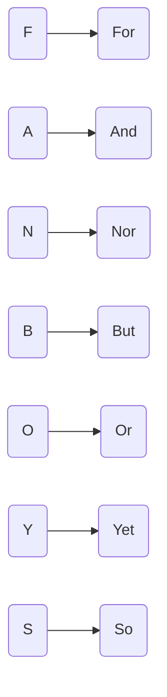

连词：连接单词、句子和从句。

## Coordinating Conjunction

助记：**FAN BOYS**

**For**：因为（since, because）

🌰 I do not eat buttons <u>for</u> they are not food. 我不吃按钮因为它们不是食物。

**And**: 连接事情（combine things)

🌰 The kangaroo robbed the bank <u>and</u> torched the saloon. 袋鼠抢劫了银行，还放火烧了酒馆。

**Not**: 连接否定的事情（combine untrue things）

🌰 She won’t leave her tree, <u>nor</u> will she speak with humans. 她不会离开她的树，也不会和其他人说话。

**But**：表示特例（express exception）

🌰 We used evey building material <u>but</u> chewing gum. 除了口香糖，我们用了所有建筑材料。

**Or**: 做选择（chooses between options）

🌰 Would you rather have a pet bear <u>or</u> a pet giraffe? 你想要一只宠物熊还是一只宠物长颈鹿？

**Yet**：对比（contrary）

🌰 I want to leave, <u>yet</u> I cannot. 我想离开，但是不能。

**So**：显示结果（show consequence）

🌰 Dougal was allergic to sheep, so he skipped the wool festival. 杜格尔对羊过敏，所以他没有去羊毛节。

## Subordinating Conjunction 从属连词

