👉 听力基础课 1： [PDF 讲义](./听力基础2.pdf)

## 1. 名字

James <u>Carter</u>

Janet <u>Geoffrey</u>

> Geoffrey 中英国人会说 “double f”，美国人会说 “ff”

Duncan <u>Thomson</u>

> 利用人名的发音来判断人名的拼写

Wendy Harries

> “Double r” 中会发生连读， /ˈdʌb(ə)l/ + /ɑ:/

Andrew **Browne**

## 2. 日期

### 2.1 Date 日期

英式美式单词不同，但雅思考试都接受

比如 color - colour， center - centre， theater - theatre， meter - metre

英式美式日期格式：
- BrE： **DD/MM** 27th January
- AmE： **MM/DD** January 27th

日期：

| 1        | 2        | 3        | 4    | 5    | 6    | 7    | 8    | 9    | 10   |
| -------- | -------- | -------- | ---- | ---- | ---- | ---- | ---- | ---- | ---- |
| **1st**  | **2nd**  | **3rd**  | 4th  | 5th  | 6th  | 7th  | 8th  | 9th  | 10th |
| 11th     | 12th     | 13th     | 14th | 15th | 16th | 17th | 18th | 19th | 20th |
| **21st** | **22nd** | **23rd** | 24th | 25th | 26th | 27th | 28th | 29th | 30th |
| **31st** |          |          |      |      |      |      |      |      |      |

注意
- 角标可以省略，但是其他情况不能省略，比如 “I'm in my third year”，这里 third 必须有角标表示序号，假设省略序号，就会影响后面的 year -> years。
- 月份、星期不建议用缩写，比如 Jan. Mon.（违背所听即所得，多了转换步骤）

- 周 + 日期：先周再日期，比如 Wednesday 27th January

### 2.2 Date of birth 出生日期

- BrE： **DD/MM/YYYY**，比如 27th January 1973
- AmE： **MM/DD/YYYY**，比如 January 27th, 1973

前三个月可以用序号替代，比如
- 27th first 1973
- 27th second 1973
- 27th third 1973

### 2.3 Time 时间

时间的写法可以是 11:30（一个冒号） 或者 11.30（一个句号）

| 写法  | 读法                                              |
| ----- | ------------------------------------------------- |
| 11.00 | eleven o’clock                                    |
| 11.15 | eleven fifteen【最简单直接的读法】                |
|       | a quarter past eleven【已经过了四分之一的 11 点】 |
| 11.30 | eleven thirty【最简单】                           |
|       | half past eleven【一半的 11 点】                  |
| 11.45 | eleven forty-five【最简单】                       |
|       | a quarter to twelve【还有四分之一到 12 点】       |
| 12.00 | twelve o’clock                                    |
|       | midday/noon【中午】                               |

## 3. 地址

国内地址从大到小：北京市，海淀区，西北旺东角路 10 号，网易研发中心

国外地址从小到大：The Sherlock Holmes Museum, 22 Baker Street, Marylebone, London, NW1 6XE

```mermaid
flowchart LR
	subgraph  clszrxlsg0001tr5aq5mwwbyf ["1"]
		direction TB
		clszrsfrj0001tr5at4z0epn8["The Sherlock Holmes Museum"] --> clszrteur0003tr5akq73ryg7["建筑"]
	end
	subgraph  clszrxw4k0003tr5ae6fs6yfu ["2"]
		direction TB
		clszrtnsr0005tr5awdi6awjm["22"] --> clszrtum50007tr5a0unp2c0q["门牌号"]
	end
	subgraph  clszry3ck0006tr5a8jg6cc6o ["3"]
		direction TB
		clszryces0007tr5ad46peesz["Baker Street"] --> clszryeys0008tr5aphpvdo1m["路名"]
	end
		subgraph  clszs2oud0001tr5amrz30wsn ["4"]
		direction TB
		clszs2sg90002tr5av3ah4p2d["Marylebone"] --> clszs2v0u0003tr5azcscexfz["区"]
	end
	subgraph  clszrxwjs0004tr5akawcamko ["5"]
		direction TB
		clszru2a10009tr5a4jy3ecj3["London"] --> clszru7em000btr5ahfnggauh["城市"]
	end
	subgraph  clszrxz420005tr5aabqveh2g ["6"]
		direction TB
		clszruddy000dtr5ackzpltuk["NW1 6XE"] --> clszrugum000ftr5agttnwmzk["邮编"]
	end
clszrxlsg0001tr5aq5mwwbyf-->clszrxw4k0003tr5ae6fs6yfu
clszrxw4k0003tr5ae6fs6yfu-->clszry3ck0006tr5a8jg6cc6o
clszry3ck0006tr5a8jg6cc6o-->clszs2oud0001tr5amrz30wsn
clszs2oud0001tr5amrz30wsn-->clszrxwjs0004tr5akawcamko
clszrxwjs0004tr5akawcamko-->clszrxz420005tr5aabqveh2g
```

- 雅思中一般不考「区」
- 英国邮编 “NW1 6XE”，中间两个是数字，其他是梓慕

