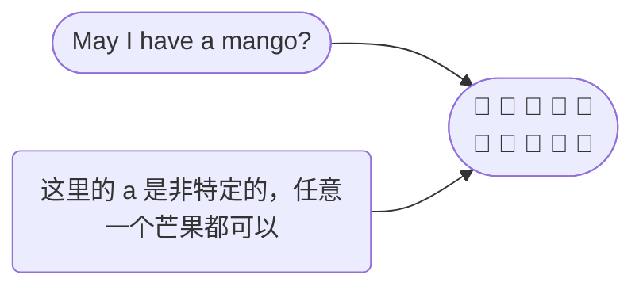
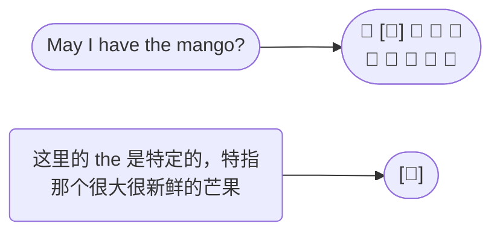

Adjective change, or describe stuff. 形容词用来改变、描述事物。

The blue bear. 蓝色的熊.

The red bear. 红色的熊.

## Article 冠词

The article tells you whether or not that something is <u>specific</u>. 冠词指示某物是否是特定的。

冠词只有三个： a/an, the. 

 

例子一：

| Article           | Explain                                                      |
| ----------------- | ------------------------------------------------------------ |
| 🐘 The elephant …… | 这里用 The 是表示上下文聊天中特定的大象（specific、definite） |
| 🐘 An elephant ……  | 表示非特定的大象，即任意一头大象（not specific、indefinite） |

 

例子二：

🥭 假设你去水果店，想买一个芒果，你会对店员说： May I have <u>a</u> mango?

🥭 假设你又去了水果店，你特别想买那一个很大很新鲜的芒果，你会指这个那个芒果说： May I have <u>the</u> mango?

A/an 和 the 的区别， the 可以用于单数和复数，a/an 只能用于单数：

- May I have the mango? ✅

- May I have the mangos? ✅

- May I have a mango? ✅

- ~~May I have a mangos?~~ ❌ 可以用 May I have some mangos?

为什么区分 a 和 an，这只是发音规律，a  apple，

