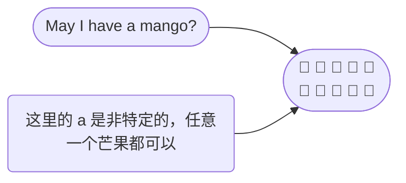
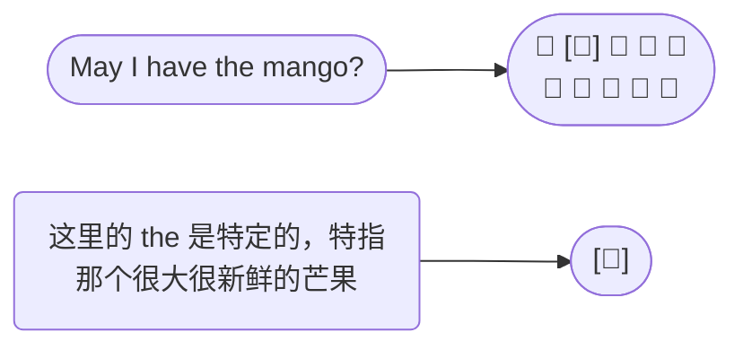

Adjective change, or describe stuff. 形容词用来改变、描述事物。

The blue bear. 蓝色的熊.

The red bear. 红色的熊.

## Article 冠词

The article tells you whether or not that something is <u>specific</u>. 冠词指示某物是否是特定的。

冠词只有三个： a/an, the. 

 

例子一：

| Article           | Explain                                                      |
| ----------------- | ------------------------------------------------------------ |
| 🐘 The elephant …… | 这里用 The 是表示上下文聊天中特定的大象（specific、definite） |
| 🐘 An elephant ……  | 表示非特定的大象，即任意一头大象（not specific、indefinite） |

 

例子二：

🥭 假设你去水果店，想买一个芒果，你会对店员说： May I have <u>a</u> mango?

🥭 假设你又去了水果店，你特别想买那一个很大很新鲜的芒果，你会指这个那个芒果说： May I have <u>the</u> mango?

 

A/an 和 the 的区别， the 可以用于单数和复数，a/an 只能用于单数：

- May I have the mango? ✅

- May I have the mangos? ✅

- May I have a mango? ✅

- ~~May I have a mangos?~~ ❌ 可以用 May I have some mangos?

 

a/an 的区别：**元音音标开头字母之前用 an**，比如 an apple，其他情况用 a。

an 只是为了方便发音，否则 a apple 发音不仅累，而且快速读的话可能会听不清

> 关于怎么区分 元音音标和辅音音标，见 👉 [https://wukaipeng.com/eng/clarify-vowel-consonant](https://wukaipeng.com/eng/clarify-vowel-consonant)

一些例子：

| A                                                            | AN                                                           |
| ------------------------------------------------------------ | ------------------------------------------------------------ |
| A bonobo（/bɒˈnəʊbəʊ/ 倭黑猩猩）  | An orangutan（/əˈræŋətæn/ 红毛猩猩）  |
| A pencil                                                     | An open door                                                 |
| A zebra（/ˈziːbrə/ 斑马）                                    | An extra pudding cup                                         |
| A sailboat（/ˈseɪlboʊt/ 帆船）                               | An **NBA** player                                            |
| A **unicorn**（/ˈjuːnɪkɔːrn/ 独角兽）                        |                                                              |

## Adverb 副词

Adverb: modifies everything that isn’t a noun. 修饰除了名词外的一切。

modifies verbs and adjectives. 修饰动词和形容词。

> 从词根看，adverb → ad + verb，ad- 是 to 的意思，而 verb 是动词的意思。

例子：

🏃‍♂️ Greyson ran <u>slowly</u>.

🚚 Pearl arranged the funiture <u>slowly</u>.

🍔 Vanessa was <u>very</u> hungry.

 

副词一般后缀是 -ly： cheerful<u>ly</u>，nice<u>ly</u>……

### Relative adverb 关系副词

关系副词有： where、when、why

假设这里有一只叫做 Peggy 的小飞龙 🐉

😃 Where are you from?

🐲 That is the cave <u>where</u> I grew up.

> 这里的 “where” 就是关系副词，用于修饰“I grew up”，表示地方（place)

😃 When did you learn to breath fire?

🐲 I learn to breath fire <u>when</u> I was ten years old.

> when 修饰 I was ten years old，表示时间（time）

😃 Do you know why it is raining fish?

🐲 I don’t know <u>why</u> that is happening.

> why 修饰 that is happening，表示原因（reason）

## Adjective order 形容词顺序

对于短语：French old white house 🏠

作为中国人，可以翻译为：法国老式白色房子

这样的表达可能没太大问题，但是对于英语母语者来说很奇怪。

 

这里涉及到形容词顺序：

1️⃣ determiner 限定词，比如“the、an”

2️⃣ opinion 观点，比如“cool”

3️⃣ size 尺寸，比如“big”

4️⃣ age 岁月，比如“old”

5️⃣ shape 形状，比如“square”

6️⃣ color 颜色，比如“black”

7️⃣ origin 起源，比如“Texan”

8️⃣ material 材料，比如“leather”

9️⃣ purpose 目的，比如“riding”

🔟 the thing 事物，比如“mower”

> 助记小技巧：dosa scomp

 

按照上述的形容词顺序，应该改为：

French old white house 👉 old white French house  老式的白色法国房子

不过一般来说，我们很少用到三个以上的形容词。

