假设我们没有代词：

👉 <u>Emma</u> laughed so hard, milk came out of <u>Emma’s</u> nose.

👉 <u>Zach</u> lifted <u>the log</u>. <u>Zach</u> found a worm under <u>the log</u>.

这两句话中，表示名词的时候，就需要重复一遍：Emma、Zach、the log

 

现在我们有了代词：

👉 <u>Emma</u> laughed so hard, milk came out of <u>her</u> nose.

👉 <u>Zach</u> lifted <u>the log</u>. <u>He</u> found a worm under <u>it</u>.

有了代词，替代前面提到的名词，表达变得简单多了。

 

通过上面的例子，我们可以明白代词<u>就是一种根据上下文动态代表其他名词的词汇</u>。

## Personal Pronouns 人称代词
""

|                          | First Person 第一人称 | Second Person 第二人称 | Third Person 第三人称                                   |
| :----------------------: | -------------------------- | --------------------------- | ------------------------------------------------------------ |
|  **Singular** 单数  | I me my mine               | you your yours              | - she her hers he him his - they them their theirs - it its |
| **Plural** **复数** | we us our ours             | you your yours              | they them their theirs                                       |

:::info 解释一下

They、them、their、theirs 可以做第三人称单数，替代 He/She，但是不指明男女：

The teacher is not responsible for the student's success or failure. <u>They</u> are only there to help the student learn. 教师不为学生的成败负责。他们只是帮助学生学习而已。

但有些人认为这样的用法是错误的。

:::

## Possessive Pronouns 物主代词

Possession = Having stuff 

| Like Adjectives 类形容词 | Like nouns 类名词 |
| ----------------------------- | ---------------------- |
| my                            | mine                   |
| our                           | ours                   |
| your                          | yours                  |
| her                           | hers                   |
| his                           | his                    |
| its                           | its                    |
| their                         | theirs                 |

🌰 Example

That is <u>my</u> book. ↔️ That book is <u>mine</u>.

That is <u>his</u> hat. ↔️ That hat is <u>his</u>.

## Reflexive Pronouns 反身代词

首先我们来看一下，一个句子里面什么是主语，什么是宾语；

I love her.

- I ➡ Subject 主语

- her ➡ Object 宾语

 

🤼‍♀️ Reflexive pronouns: subject and object are the same thing. 当<u>主语和宾语是一样</u>的时候，那么就用到<u>反身代词</u>。

🌰 Example

Janelle made <u>herself</u> breakfast. 嘉内尔给她自己做了早餐。（这里的主语和宾语都是 Janelle）

Roderich saw <u>himself</u> in the mirror.

| Personal | Reflexive             |
| -------- | --------------------- |
| me       | myself                |
| us       | ourselves             |
| you      | yourself / yourselves |
| it       | itself                |
| her      | herself               |
| him      | himself               |
| Them     | themselves            |

## Relative Pronouns 关系代词

Relative pronouns: They link independent and dependent clauses together. 把主句和从句连接在一起。

🌰 Example

The man <u>who sold the world</u> is coming by on Tuesday.

🫅 主句：The man is coming by on Tuesday。

🙇 从句：who sold the world

 

Who, who, whose, that, and which.

- The salad <u>that</u> I bought was wilted.
- The man <u>that</u> I saw smiled.
- The witch <u>who</u> cast the spell is kind.

### That Versus Which 

有两家语言学派：

🧐 Prescriptivists 规范主义者：认为语言有规范，并且是严格的。

🤪 Descriptivists 描述主义者：同样认为语言有规范，但是规范是随着实际情况改变的。

 

对于目前 that 和 which 的使用，并没有一致的规则，David 根据对两家语言学派的研究，得出了两条基本规则：

1️⃣ **“That” is bad with commas.**

> Brain Garnar says, nine times out of ten, if you want to use a relative pronoun and you’re trying to choose between “that” and “which”, you should probably use “that” and the one time out of ten that you do want to use “which”, you’re supposed to use a comma first.
>
> 布莱恩·加纳说过，如果你使用关系代词，要从“that”或者“which”中挑选一个，<u>90% 情况下你会使用“that”</u>，10% 的时候，<u>如果前面有逗号，你才会想要用“which”</u>。

👉 例句 1：The carrot, <u>which</u> was orange, was tasty.  ✅

这句例句属于 no restrictive relative clauses，即属于非限制性关系从句，也就是把这句“which was orange”从句去掉，并不会影响主句，用 which 去引导非限制性关系从句，这种表达是合理的。

👉 例句 2：The carrot <u>which</u> was orange was tasty.  ✅

这句例句属于 restrictive relative clauses，即限制性关系从句，不能去掉从句，它限制了这个颜色必须是 orange 的 carrot，用 which 去引导限制性关系从句，这种表达也是合理的。

👉 例句 3：The carrot, <u>that</u> was orange, was tasty.  ❌

这句例句和例句 1 一样，都属于 no restrictive relative clauses，但它是用“that”去引导的，虽然在语法层面没有问题，并没有一个强制的规则禁止这样做，但是对于 native speaker 来说，that 前面跟逗号的表达是非常奇怪的，因此不建议这样用。

👉 例句 4：The carrot <u>that</u> was orange was tasty. ✅

这句例句和例句 2 一样，都属于 restrictive relative  clauses，这种表达同样是合理的。

 

2️⃣ **“Which” is bad with people.**

Which 不适合指代人，that 适用于指代一切。

The woman <u>that</u> boarded the plane. ✅

The woman <u>which</u> boarded the plane. ❌

 

### Who Versus Whom

最基础的规则是，Who 和 Whom 都是指代人，Who 在从句中做主语（Subject），Whom 在从句中做宾语（Whom）。

👉 The spy <u>who</u> loved me. 

👉 The spy <u>whom</u> I love.

 

但是，who 扩展开来，也可以做从句中做宾语，但是 whom 则不可以在从句中做主语。

The spy <u>who</u> loved me. ✅

The spy <u>whom</u> loved me. ❌

The spy <u>who</u> I love. ✅

The spy <u>whom</u> I love. ✅

基本上，你可以只用 who。

## Subject and Object Pronouns 主语代词和宾语代词

Subject 主语： The part of a sentence that does stuff. 进行动作的

Object 宾语： The part of the sentence that has stuff done to it. 被动作作用的。

```mermaid
---
title: 🌰 例子
---
graph TB
A(["He wrote an e-mail"]) -- He --> B([Subject 主语])
A -- "e-mail" --> C([Object 宾语])
```

 

 

Subject pronouns include *I, we, he, she, you, they, who,* and *it*.

Object pronouns include *me, us, him, her, you, them, whom* and *it.*

## Grammatical Person and Pronouns 语法上的人、代词

The 3 persons spoken of in grammatical construction are based on distance. 在语法结构中提到的三个人称是<u>基于距离</u>来确定的。

🧏 The 1st person is the one closest to you: yourself. The pronouns are I, me, my, we, us, and our. 第一人称是距离你最近的：<u>你自己</u>。对应的代词是 I、me、my、we、use，和 our。

🙋 The second person is the one whom you are addressing. The pronouns are you, your, and yours. 第二人称是你<u>正在招呼的那个人</u>。对应的代词是 you、your 和 yours。

👨‍👩‍👦‍👦 The third person is everyone else. The pronouns are he, she, it, they, them, and theirs. 第三人称是<u>其他所有人</u>。代词是：he、she、it、they、them 和 theirs。

## Grammatical Number 语法上的数

Pronoun number agreement 代词数一致，代词数和主语数要一致：

👉 The <u>elephant</u> was grey. → <u>It</u> was grey.

👉 The <u>elephants</u> were grey → <u>they</u> were grey

 

Singular: one of a thing. 单数

Plural: more than one thing. 复数

| Singular | Plural |
| -------- | ------ |
| I        | we     |
| me       | us     |
| my       | our    |

 

Two exceptions can be singular or plural 既可以是单数又可以是复数：

- you
- they

✨ <u>Be consistent</u>. 保持统一，在上下文中，如果 you/they 是指单数，那么都要一直保持单数；同理，如果是复数，要一直保持复数。

## Indefinite Pronoun 不定代词

Indefinite pronoun: undefined、uncertain. 不定代词跟它的名字一样，是未定义的、不指定的。

不定代词有：Any, anybody, each, everyone, nobody...

1️⃣ They can be used as subjects or objects. 不定代词可以用于主语或者谓语。

```mermaid
---
title: 🌰 例子
---
%%{init: {"flowchart": {"htmlLabels": false}} }%%
graph LR;
A(["👩 David, do you want pizza?"])-->B(["`🙋 Yes, please! I'd love **some**`"])
A-->C(["`🙋 Yes, please! **Some** would be great!`"])
```

2️⃣ Both, neither, and either retain the dual. 这三个不定代词 both、neither、either 可以代指两个主语/谓语，它们是英语中仅有的可以指代两件事物的单词。

```mermaid
---
title: 🌰 例子
---
%%{init: {"flowchart": {"htmlLabels": false}} }%%
graph LR;
A(["👩 Do you like mangoes or cherries more?"])-->B(["`😃 I like **both** equally.`"])
```

3️⃣ Usually treated as singular. (except for both, many, others, several, and sometimes some) 通常认为是单数形式。（除了 both、many、others，有时候还有 some）

**Nobody** <u>was</u> home. 没人在家。↔️ was 是单数形式

**Everybody** <u>knows</u> that I love onions. ↔️ knows 是第三人称单数形式

**Everyone** <u>was</u> crouched behind furniture to surprise me... but I already knew **they** were there. 所有人都蜷缩在家具背后给我一个惊喜。。。但是我已经知道他们在那里了。 ↔️ 前半句是单数形式，后半句中用复数 they 去指代 everyone

:::tip 在语法上会不会有点奇怪呢？

在第三句中，用复数 they 去指代单数 Everyone，这在语法上看似很奇怪。

正如《Garnar’s Modern American Usage》作者 Garnar 说： “Sometimes meaning rather than grammar governs the agreement.” <u>某些情况下，要保证句意一致而非语法一致</u>。也就是句子能说得通、说得顺，那就是合理的。

不定代词被认为是单数形式，这本身就不太符合语法，其实英语本来就混乱，

:::

## Emphatic Pronoun 强调代词

同反身代词，但它是在一种表示强调的语境下使用的：

👉 I’ll do it <u>myself</u>!  我会做的！

👉 I heard it <u>myself</u>. 我听到了。

👉 The princess <u>herself</u>. 公主本人。

