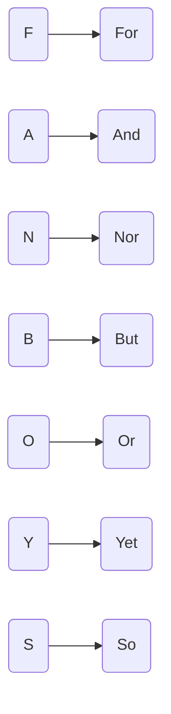

连词：连接单词、句子和从句。

## Coordinating Conjunctions 并且连词

助记：**FAN BOYS**

**For**：因为（since, because）

🌰 I do not eat buttons <u>for</u> they are not food. 我不吃按钮因为它们不是食物。

**And**: 连接事情（combine things)

🌰 The kangaroo robbed the bank <u>and</u> torched the saloon. 袋鼠抢劫了银行，还放火烧了酒馆。

**Not**: 连接否定的事情（combine untrue things）

🌰 She won’t leave her tree, <u>nor</u> will she speak with humans. 她不会离开她的树，也不会和其他人说话。

**But**：表示特例（express exception）

🌰 We used evey building material <u>but</u> chewing gum. 除了口香糖，我们用了所有建筑材料。

**Or**: 做选择（chooses between options）

🌰 Would you rather have a pet bear <u>or</u> a pet giraffe? 你想要一只宠物熊还是一只宠物长颈鹿？

**Yet**：对比（contrary）

🌰 I want to leave, <u>yet</u> I cannot. 我想离开，但是不能。

**So**：显示结果（show consequence）

🌰 Dougal was allergic to sheep, so he skipped the wool festival. 杜格尔对羊过敏，所以他没有去羊毛节。

## Subordinating Conjunctions 从属连词

Clause have two type 从句有两种：

1. Independent Clause 独立从句，包含主语+动词
2. Dependent Clause 从属从句

> All sentences $=$ Clauses 所有的句子 $=$ 从句
>
> All Clauses $\ne$ Sentences 所有的从句 $\ne$ 句子

Herbert performed his irresponsible experiments because he was curious.

前半段「Herbert performed his irresponsible experiments」是独立从句，独立代表一件事情。

后半段「because he was curious」是从属从句，提供更进一步的信息，没办法独立，需要从属于另外的从句才有意义。

连接从属从句的连词，就是**从属连词**

🌰 **Although** she loved Sir Reginald, Lady Penelope hated his pranks. 尽管她爱着雷金纳德爵士，但佩内洛普夫人讨厌他的恶作剧。

这里「Although」就是从属连词

从属连词：

| Column 1 | Column 2 | Column 3    | Column 4    |
| -------- | -------- | ----------- | ----------- |
| After    | Because  | Even though | Like        |
| Although | Before   | If          | Rather than |
| As       | Even if  | If only     | Since       |
| As if    | That     | Though      | Until       |
| When     | Where    | Whereas     | Whether     |
| Wherever | Which    | While       |             |

## Correlative Conjunctions 对等连词

- **Either/or**: Either the wallpaper go, or I do.

- **Neither/nor**: Neither Jia nor Becca like Howard.

- **Both/and**: Both Bigby and LaDoux were career criminals.

- **As/so**: As goes Kansas, so goes nation.

- **Whether/or**: Whether you like shrimp or chocolate, there’s certain to be something for you at the Veracruz food fair.

