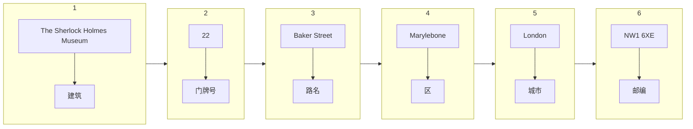

👉 听力基础课 1： [PDF 讲义](./听力基础2.pdf)

## 1. 名字

James <u>Carter</u>

Janet <u>Geoffrey</u>

> Geoffrey 中英国人会说 “double f”，美国人会说 “ff”

Duncan <u>Thomson</u>

> 利用人名的发音来判断人名的拼写

Wendy Harries

> “Double r” 中会发生连读， /ˈdʌb(ə)l/ + /ɑ:/

Andrew **Browne**

## 2. 日期

### 2.1 Date 日期

英式美式单词不同，但雅思考试都接受

比如 color - colour， center - centre， theater - theatre， meter - metre

英式美式日期格式：
- BrE： **DD/MM** 27th January
- AmE： **MM/DD** January 27th

日期：

| 1        | 2        | 3        | 4    | 5    | 6    | 7    | 8    | 9    | 10   |
| -------- | -------- | -------- | ---- | ---- | ---- | ---- | ---- | ---- | ---- |
| **<u>1st</u>**  | **<u>2nd</u>**  | **<u>3rd</u>**  | 4th  | 5th  | 6th  | 7th  | 8th  | 9th  | 10th |
| 11th     | 12th     | 13th     | 14th | 15th | 16th | 17th | 18th | 19th | 20th |
| **<u>21st</u>** | **<u>22nd</u>** | **<u>23rd</u>** | 24th | 25th | 26th | 27th | 28th | 29th | 30th |
| **<u>31st</u>** |          |          |      |      |      |      |      |      |      |

注意
- 角标可以省略，但是其他情况不能省略，比如 “I'm in my third year”，这里 third 必须有角标表示序号，假设省略序号，就会影响后面的 year -> years。
- 月份、星期不建议用缩写，比如 Jan. Mon.（违背所听即所得，多了转换步骤）

- 周 + 日期：先周再日期，比如 Wednesday 27th January

### 2.2 Date of birth 出生日期

- BrE： **DD/MM/YYYY**，比如 27th January 1973
- AmE： **MM/DD/YYYY**，比如 January 27th, 1973

前三个月可以用序号替代，比如
- 27th first 1973
- 27th second 1973
- 27th third 1973

### 2.3 Time 时间

时间的写法可以是 11:30（冒号） 或者 11.30（句号）

| 写法  | 读法                                              |
| ----- | ------------------------------------------------- |
| 11.00 | eleven o’clock                                    |
| 11.15 | eleven fifteen【最简单直接的读法】                |
|       | a quarter past eleven【已经过了四分之一的 11 点】 |
| 11.30 | eleven thirty【最简单】                           |
|       | half past eleven【一半的 11 点】                  |
| 11.45 | eleven forty-five【最简单】                       |
|       | a quarter to twelve【还有四分之一到 12 点】       |
| 12.00 | twelve o’clock                                    |
|       | midday/noon【中午】                               |

## 3. 地址

国内地址从大到小：北京市，海淀区，西北旺东角路 10 号，网易研发中心

国外地址**从小到大**：The Sherlock Holmes Museum, 22 Baker Street, Marylebone, London, NW1 6XE

- 雅思中一般不考「区」
- 英国邮编 “NW1 6XE”，中间两个是数字，其他是字母

## 4. 数字

### 4.1 纯数字

1. 电话号码
2. 银行卡号：Credit card No. 3303 8450 2045 6837

> 写数字的过程和读数字的过程是一致的，要听对，先读对

3. 几十和十几：fourteen /ˌfɔːrˈtiːn/ forty /ˈfɔːrti/

> 从**重音**、**长短音**、**鼻音**这三方面去区别

4. 大数

| Number                  | Read                                  |
| ----------------------- | ------------------------------------- |
| 150                     | 1 hundred and 50                      |
| 1500                    | 15 hundred / 1 thousand and 5 hundred |
| 15,000                  | 15 thousand                           |
| 15,000,000（6 个零）    | 15 million                            |
| 15,000,000,000（9个零） | 15 billion                            |

> - 逗号非必须
>
> - 考试过程中，能用数字表达尽量用数字

5. 钱数，常考就三个：
   1. £ pound：£50 50 英镑
   2. € euro：€75 75 欧元
   3. \$ dollar：\$150 150 美元

> 如果有小数的话，比如 **£1.50**，应该读成「**one pound fifty**」
>
> 扩展了解（不考）：100 pence 便士 = £1 英镑，100 cents 美分 = \$1 美元

6. 小数，0.5 有三种读法
   1. 0 读成字母 o：o point 5
   2. 省略 0：point 5
   3. 用 naught： naught point 5
7. 分数：分子用基数，分母用序数；分子大于1的话，分母需要用复数
   1. $1/3$： one third
   2. $2/3$： two thirds

### 4.2 数字 + 字母

Postcode: GT8 9EW

Flight No. AC936

Email: pk2@cat.com

Reference No. 37254T

## 5. 职业

| -er          | -or       | -ist         | -man        | -ant       |
| ------------ | --------- | ------------ | ----------- | ---------- |
| lecturer     | director  | pianist      | craftsman   | assistant  |
| waiter       | advisor   | scientist    | businessman | accountant |
| engineer     | tutor     | dentist      | salesman    | consultant |
| manager      | professor | receptionist |             |            |
| designer     |           |              |             |            |
| photographer |           |              |             |            |
| lawyer       |           |              |             |            |
| hairdresser  |           |              |             |            |

