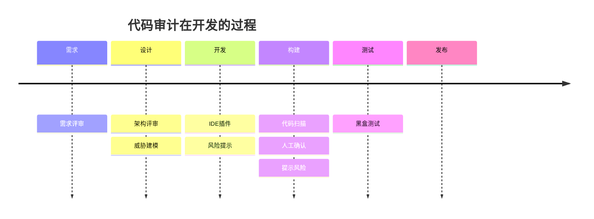

为什么代码有漏洞？

1. 开发人员问题，没有经过安全培训
2. 成本问题

 

## 代码安全审计

代码安全审计：识别特性和设计相关的安全缺陷以及原因。

## 代码审计技术

审计程序中的安全缺陷

- 应用程序功能和业务规则
- 上下文：确定安全审查的范围，确保不会矫枉过正
- 敏感信息
- 用户角色和访问权限
- 应用类型
- 应用类型：桌面、移动、Web，不同类型平台面临不同的风险
- 代码
- 设计：Structs、Spring、自行设计框架等等

## 确定攻击面

通过分析输入、数据流和事务来确定攻击面。实际执行代码安全审计的主要部分是对攻击面进行分析。应用程序接受输入并产生某种输
出。第一步是识别代码的所有输入。

应用程序的输入可能包括以下要点:

1. 浏览器输入
2. Cookie
3. 文件
4. 命令行参数
5. 环境变量

## PHP代码审计思路

- 敏感函数方法回溯(反向审计)

  - 查找项目中的敏感函数方法

- 查找传入的参数判断用户是否可控用户可控参数正向查找

  - 查找项目中的用户输入 追踪用户输入 判断是否得到有效的过滤/调用敏感函数/存在逻辑问题

- 关键业务功能分析(功能审计)

  - 专⻔审计易出现漏洞的关键功能点
    - 如 头像上传 系统登陆 文件下载 等功能

- 审计所有代码

  

## 用户可控参数  
来自用户可控的输入, 安全审计中永远不要相信用户的输入 
