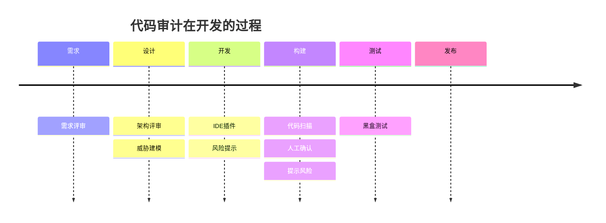

为什么代码有漏洞？

1. 开发人员问题，没有经过安全培训
2. 成本问题

 

## 代码安全审计

代码安全审计：识别特性和设计相关的安全缺陷以及原因。


## 代码审计技术

审计程序中的安全缺陷



- 应用程序功能和业务规则
- 上下文：确定安全审查的范围，确保不会矫枉过正
- 敏感信息
- 用户角色和访问权限
- 应用类型
- 应用类型：桌面、移动、Web，不同类型平台面临不同的风险
- 代码
- 设计：Structs、Spring、自行设计框架等等


## 确定攻击面

通过分析输入、数据流和事务来确定攻击面。实际执行代码安全审计的主要部分是对攻击面进行分析。应用程序接受输入并产生某种输
出。第一步是识别代码的所有输入。

应用程序的输入可能包括以下要点:

1. 浏览器输入
2. Cookie
3. 文件
4. 命令行参数
5. 环境变量


## PHP代码审计思路

- 敏感函数方法回溯(反向审计)

  - 查找项目中的敏感函数方法

- 查找传入的参数判断用户是否可控用户可控参数正向查找

  - 查找项目中的用户输入 追踪用户输入 判断是否得到有效的过滤/调用敏感函数/存在逻辑问题

- 关键业务功能分析(功能审计)

  - 专⻔审计易出现漏洞的关键功能点
    - 如 头像上传 系统登陆 文件下载 等功能

- 审计所有代码

  

## 用户可控参数  
来自用户可控的输入, 安全审计中永远不要相信用户的输入 


| 变量/常量/函数/等                                 | 描述                                                         |
| ------------------------------------------------- | ------------------------------------------------------------ |
| `$_SERVER`                                        | 包含 服务器信息 环境变量 用户传入的 HTTP 头和 URI 路径等信息 |
| `$_GET`<br />`$HTTP_GET_VARS`                     | 包含 用户传入的 URL 参数                                     |
| `$_POST`<br />`$HTTP_POST_VARS`                   | 包含 用户传入的 POST BODY 的参数(当 HTTP 头中 `Content-Type` 值为 `application/x-www-form-urlencoded` 或 `multipart/form-data` 时才会被传入) |
| `$_FILES`<br />`$HTTP_POST_FILES`                 | 包含 用户上传文件信息 文件内容原文件名 临时文件名 大小等信息 |
| `$_COOKIE`<br />`$HTTP_COOKIE_VARS`               | 包含 用户传入的 HTTP 头中的 Cookies kv 值                    |
| `$_REQUEST`                                       | 同时包含 `$GET` `$POST` `$_COOKIE`                           |
| php://input<br />`$HTTP_RAW_POST_DATA`            | 包含 用户 POST 请求中 BODY 的完整数据常见用法 `file_get_contents('php://input');` |
| `apache_request_headers()`<br />`getallheaders()` | 包含 用户传入的 HTTP 头（Apache ONLY）                       |


```php
$_SERVER['HTTP_ACCEPT_LANGUAGE']//浏览器语言 
$_SERVER['REMOTE_ADDR'] //当前用户 IP 。 
$_SERVER['REMOTE_HOST'] //当前用户主机名 
$_SERVER['REQUEST_URI'] //URL
$_SERVER['REMOTE_PORT'] //端口。 
$_SERVER['SERVER_NAME'] //服务器主机的名称。 
$_SERVER['PHP_SELF']//正在执行脚本的文件名 
$_SERVER['argv'] //传递给该脚本的参数。 
$_SERVER['argc'] //传递给程序的命令行参数的个数。 
$_SERVER['GATEWAY_INTERFACE']//CGI 规范的版本。 
$_SERVER['SERVER_SOFTWARE'] //服务器标识的字串 
$_SERVER['SERVER_PROTOCOL'] //请求⻚面时通信协议的名称和版本 
$_SERVER['REQUEST_METHOD']//访问⻚面时的请求方法 
$_SERVER['QUERY_STRING'] //查询(query)的字符串。 
$_SERVER['DOCUMENT_ROOT'] //当前运行脚本所在的文档根目录 
$_SERVER['HTTP_ACCEPT'] //当前请求的 Accept: 头部的内容。 
$_SERVER['HTTP_ACCEPT_CHARSET'] //当前请求的 Accept-Charset: 头部的内容。 
$_SERVER['HTTP_ACCEPT_ENCODING'] //当前请求的 Accept-Encoding: 头部的内容 
$_SERVER['HTTP_CONNECTION'] //当前请求的 Connection: 头部的内容。例如：“Keep-Alive”。 
$_SERVER['HTTP_HOST'] //当前请求的 Host: 头部的内容。 
$_SERVER['HTTP_REFERER'] //链接到当前⻚面的前一⻚面的 URL 地址。 
$_SERVER['HTTP_USER_AGENT'] //当前请求的 User_Agent: 头部的内容。 
$_SERVER['HTTPS']//如果通过https访问,则被设为一个非空的值(on)，否则返回off
$_SERVER['SCRIPT_FILENAME'] #当前执行脚本的绝对路径名。 
$_SERVER['SERVER_ADMIN'] #管理员信息 
$_SERVER['SERVER_PORT'] #服务器所使用的端口 
$_SERVER['SERVER_SIGNATURE'] #包含服务器版本和虚拟主机名的字符串。 
$_SERVER['PATH_TRANSLATED'] #当前脚本所在文件系统（不是文档根目录）的基本路径。 
$_SERVER['SCRIPT_NAME'] #包含当前脚本的路径。这在⻚面需要指向自己时非常有用。 
$_SERVER['PHP_AUTH_USER'] #当 PHP 运行在 Apache 模块方式下，并且正在使用 HTTP 认证功能，这个变量便是用户输入的用户名。 
$_SERVER['PHP_AUTH_PW'] #当 PHP 运行在 Apache 模块方式下，并且正在使用 HTTP 认证功能，这个变量便是用户输入的密码。 
$_SERVER['AUTH_TYPE'] #当 PHP 运行在 Apache 模块方式下，并且正在使用 HTTP 认证功能，这个变量便是认证的类型
```


