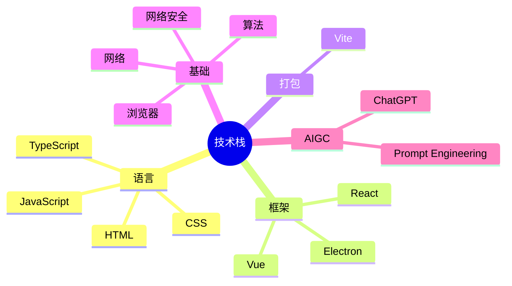

备考方针：

- 一道面试题由一个或者多个**知识点组成**（以面试题为导向进行复习，但关注知识点而非面试题）

- 每个知识点都是有价值的，但每个知识点在面试过程中的**出现频率是不一样**的。

- 对于低、中、高频知识点，采取 **1 - 3 - 6 注意力分配**方法。（低频了解、中频掌握、高频背诵）。

- 知识点不是孤岛，而是**互相关联**（注重知识点之间的联系和组合）

具体策略：

1. 收集：收集大厂面试真实题目（大厂题目具备水平性、权威性和代表性）
2. 汇总：分门别类，按照技能树归类
3. 提取分析：提取知识点，分析低、中、高频
4. 学习：学习掌握，查漏补缺

面试题来源：

- BOSS 直聘-有了-前端题库：https://youle.zhipin.com/interview-questions?code=100901&sortType=1
- JS 每日一题：https://vue3js.cn/interview/
- 大厂面试每日一题：https://q.shanyue.tech/fe
- 前端面试题宝典：https://fe.ecool.fun/
- 前端面试每日 3+1：https://github.com/haizlin/fe-interview
- 大前端面试宝典：https://lucifer.ren/fe-interview/#/

技术栈：

- 语言：HTML、CSS、JavaScript、TypeScript
- 框架：Vue、React、Electron
- 打包：Vite
- 基础：网络、网络安全、浏览器、算法
- AIGC：ChatGPT、Prompt Engineering
- 项目

## 语言

### HTML

### CSS

### JavaScript

### TypeScript

## 框架

### Vue

### React

### Electron

## 打包

### Vite

## 基础

### 网络

### 网络安全

### 浏览器

### 算法

## AIGC

### ChatGPT

### Prompt Engineering

## 项目
