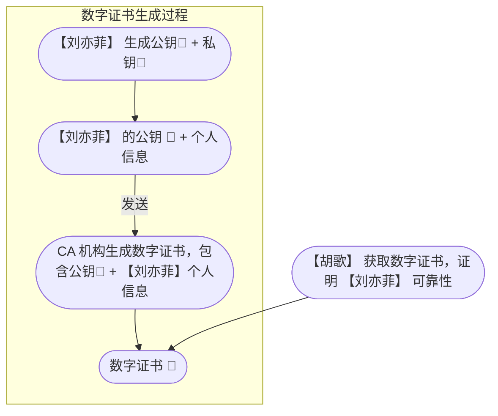

👨‍🏫 考点：数字签名，数字证书

---

⭐️ 数字签名的概念、原理

假设现在 【胡歌】 和 【刘亦菲】 互相通信，【胡歌】 会遇到这么几个问题：

问题一：请求正文被人偷看了怎么办？

问题二：如何确定响应正文是 【刘亦菲】 回复的，而不是第三人 【蔡徐坤】？

问题三：响应正文被第三人 【蔡徐坤】 篡改了怎么办？

---

这个时候就需要加密通信的内容了，非对称加密中，会有私钥和公钥，他们有如下特点：

- <u>私钥加密的内容，只有公钥才能解开</u>，同样地，公钥加密的内容，只有私钥才能解开
- <u>公钥是公开的，任意人都可以拿到</u>

现在 【胡歌】 持有公钥，【刘亦菲】 持有私钥：

😭 假设 【蔡徐坤】 截获 【胡歌】 请求的加密内容，由于没有私钥，所以无法确定解开内容。 问题一被解决 ❌

😈 但是，如果 【蔡徐坤】 截获 【刘亦菲】 响应的加密内容，【蔡徐坤】 持有公钥，就能解开并篡改该内容。问题二和问题三还没有被解决

---

此时 【刘亦菲】 需要给响应正文加上签名。

1️⃣ 响应正文 + Hash 算法 🚜  → 摘要

> 生成的摘要是一段短的乱码，比如：`Hk9yfy1nGXdhi06EDvvTvd/Lq1xsFjxoSYkWm8MmAkkqYXZLraSEzyxxxu4c`，只要正文不变，摘要也就不变

2️⃣ 摘要 + 私钥 🔑 → 签名

> 摘要本身很短，加密之后的签名也会更短

3️⃣ 签名 + 响应正文 → 返回给 【胡歌】

4️⃣ 【胡歌】 摘要 + 公钥 🔑  → 原摘要

5️⃣ 响应正文 + Hash 算法 🚜 → 新摘要

6️⃣ 对比 原摘要和新摘要

> 匹配成功，证明响应正文没有被篡改过，解决问题三 ❌

 

⭐️ 数字证书的概念、原理

可以看到，上述过程中，只解决了内容没有被篡改（即问题一和问题三），但是没有解决内容确实来自于 【刘亦菲】（问题二），因为 【蔡徐坤】 也可以自己生成一对私钥和公钥，让 【胡歌】 去验证整个解密过程。

如何确定响应正文来自于私钥拥有者，这就涉及到了数字证书：

1️⃣ 私钥拥有者，必然是公钥的拥有者，<u>证明公钥拥有者，也就是间接证明了私钥拥有者</u>

2️⃣ 【刘亦菲】 把公钥和个人信息发送给证书机构（Certification Authority）

3️⃣ CA 机构颁发一个证书，证书包含 【刘亦菲】 的公钥和个人信息

4️⃣ 【刘亦菲】 把证书分发到互联网上，也就是验证了 【刘亦菲】 公钥来源的可靠性

问题二解决 ❌

---

🌟 加分点 新的问题产生了，如何确定数字证书不是 【蔡徐坤】 伪造的？

首先 CA 机构也会维护自己的公钥 🔑 + 私钥 🔑

其次，证书上除了 【刘亦菲】 的公钥和个人信息，还有加上 CA 机构对其的数字签名。

【刘亦菲】 用 CA 机构的公钥就可以验证数字证书的可靠性

---

🌟 加分点 又是新的问题，如何证明 CA 机构公钥不是 【蔡徐坤】 伪造的？

这看起来又回到了原点，目前的方案是<u>证书链+预装根证书</u>。

证书链： CA 机构证书是一个树形结构，下层证书的验证依靠上层。

预装根证书：一些操作系统、浏览器或者应用程序在出厂的时候，会预先安装根证书，这些证书会被认为是可信的，也就是信任的终点，走出验证的死循环。

---

🌟 加分点 真正的 HTTPS 通信

上述流程只是为了讲解简化，真正的 HTTPS 通信其实是这样的：

1️⃣ 客户端 Hello：【胡歌】 发送“Client Hello”，其中包括：

- 【胡歌】 支持的 SSL/TLS 版本
- 加密套件（按优先级排序）
- 一个随机生成的数字（Client Random）

2️⃣ 服务端 Hello：【刘亦菲】 响应“Server Hello”

- 【胡歌】、【刘亦菲】 共同支持的 SSL/TLS 版本、加密套件
- 一个随机生成的数字（Server Random）

3️⃣ 服务器证书：【刘亦菲】 发送 CA 证书（其中包含公钥 + 【刘亦菲】 的信息）

4️⃣ 密钥交换：【胡歌】 验证 【刘亦菲】 的证书。如果有效，生成一个“预主密钥”（Pre-Master Secret）并用公钥加密，发送给 【刘亦菲】。

5️⃣ 会话密钥生成：【胡歌】、【刘亦菲】 通过 Pre-Master Secret +Client Random+Server Random，独立地计算出<u>会话密钥</u>。

6️⃣ 加密通信：【胡歌】、【刘亦菲】 使用会话密钥进行<u>对称性加密通话</u>，而不是公钥 or 私钥。

