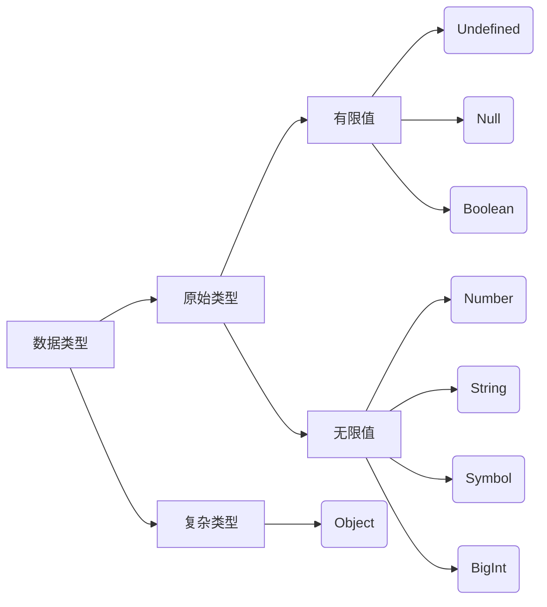

> JavaScript高级程序设计最新一版（第四版）笔记，持续更新中
> 本笔记只记录重点、难点、新点


# 第2章 HTML中的JavaScript

## 2.1 <code>script</code>标签


1. `<script>`标签的8个属性

attribute|status|describe
:-:|:-:|:-
`async`|可选，只对外部脚本文件有效|和其他资源一起异步加载
`charset`|不建议用，大部分浏览器会忽视该值|使用scr属性时指定代码字符集
`crossorigin`|可选，默认不实用|配置相关请求的CORS，值为`anonymous`和`use-credentials`
`defer`|可选，只对外部脚本文件有效|文档解析和显示完成后再加载
`integrity`|可选|验证子资源完整性，可用于检验CDN所得内容
`language`|废弃|指定脚本语言
`scr`|可选|包含外部脚本文件
`type`|可选|一般用于模块引入`type="module"`

2. `<script>`元素中的代码被计算完成之前，页面的其余内容不会被加载，也不会被显示。

3. `<script></script>`必须成对，单独的`<script src="example.js" />`是无效的
4. 在`<script src="example.js">...code....</script>`中，code代码会被忽略
5. 对于src中的资源，浏览器会使用GET请求来获取其指定资源
6. 若无`defer`和`async`属性，浏览器会按照`<script>`出现位置顺序加载它们。
7. 现代Web应用程序通常将`JavaScript`引用放在`<body>`元素中的页面内容后面。
8. `defer`属性开启后脚本会在整个页面解析后在加载，一般只在一个脚本开启`defer`，因为实际应用中多个开启`defer`属性的脚本会乱序加载。
9. `async`属性开启后会和页面解析一同加载，开启`async`属性的脚本也成为**异步脚本**，多个异步脚本也会乱序加载，因此异步脚本之间不能有依赖关系，并且异步脚本加载期间不能修改DOM
10. 动态加载脚本过程中 是以异步方式加载的：

```javascript
	<script>
		let script = document.createElement('script')
		script.src = './print.js'
		document.head.append(script) 
	</script>
```
由于不是所有浏览器都支持`async`属性，为了统一动态脚本加载，可以将其设置为同步加载

```javascript
	<link rel="preload" href="./print.js" as="script">
	<script>
		let script = document.createElement('script')
		script.src = './print.js'
		script.async = false
		document.head.append(script) 
	</script>
```
> 引入`<link rel="preload" href="./print.js" as="script">`是为了让浏览器预加载器知道有这么一个资源要加载，不然动态脚本加载对预加载器是不可见的，就会影响到该资源在资源获取队列的优先级，进而影响性能。

## 2.2 行内代码与外部文件
 
1. 最佳实践：JavaScript代码由外部引入
> 主要的理由有：
> - **便于维护**
> - **便于缓冲**，当有两个网页需要同一js文件时，浏览器在前一网站缓存的该js文件就能直接给后一网站了

## 2.3 文档模式
1. **混杂模式/怪异模式  *Quirks Mode*** ：支持一些非标准特性
2. **标准模式 *Standars Mode*** ：兼容标准

html5开启标准模式
```
<!-- HTML5 -->
<!DOCTYPE HTML>
```
3. **准标准模式 *Almost Standars Mode***：支持多数标准
> 一般说标准模式就指非怪异模式的文档模式

## 2.4 <code>noscript</code>标签
 

1. 目前用于禁用JavaScript中
2. `<noscript>`标签用于`<body>`标签中

# 第3章 语言基础
## 3.4 数据类型
 

ECMAScript有7种简单数据类型（也成为**原始类型**）和1种复杂类型共8种类型：



> ES2020新增了`BigInt`，详细可见阮一峰的ES6入门教程[https://es6.ruanyifeng.com/#docs/number#BigInt-%E6%95%B0%E6%8D%AE%E7%B1%BB%E5%9E%8B](https://es6.ruanyifeng.com/#docs/number#BigInt-%E6%95%B0%E6%8D%AE%E7%B1%BB%E5%9E%8B)
## 3.5 操作符
### 3.5.1 一元操作符
#### 1. 递增/递减操作符
 


> 当使用前缀递增或者前缀递减时，变量的值都会在语句被求值之间所改变（在计算机科学中，这通常被认为具有**副作用 *side effect***）

### 3.5.2 位操作符
 

1. 底层存储用64位，位操作用32位
	- ECMAScript中数值均以IEEE756的64位存储
	- 位操作数值时会将64位转换为32位**整数**，作为**开发人员只关心32位即可**
> 注意位操作前会把数值转换为**整数**，所以以下位操作结果都为`16`
> `64  >> 2`
> `64.1 >> 2 ` 
> `64.9 >> 2`
2. 负值以**补码**形式存放
3. 位操作时会经历：64bit :fast_forward: 32bit :fast_forward:64bit，转换过程产生的副作用是`NaN`和`Infinity`在位操作中会被当成`0`来处理


Bitwise Operators | Notation
:-|:-
Bitwise NOT|`~`
Bitwise AND|`&`
Bitwise OR|`|`
Bitwise XOR|`^`
Left Shift|`<<`
Signed Right Shift|`>>`
Unsigned Right Shift|`>>>`

> 为什么右移有“有无”符号之别，而左移却没有？
> 详见本人另一篇博文[为什么右移有“有无”符号之别，而左移却没有？](https://blog.csdn.net/Cap220590/article/details/112338477)

### 3.5.3 布尔操作符
 

1. 连续使用两个逻辑非`!`，可以把任意值转换为布尔值：
```javascript
!!0          \\false
!!1          \\true
!!0n         \\false
!!1n         \\true
!!""         \\false
!!"blue"     \\true
!!Symbol()   \\true
```
2. 利用布尔值的短路特性避免给`null`和`undefined`赋值

```javascript
 let a = true || null
 console.log(a) // true
 
 let b = null || true
 console.log(b) // true
```

### 3.5.5 指数操作符
 

1. **指数操作符**`**`，等同于`Math.pow()`，
2. **指数赋值操作符**`**=`

### 3.5.8 相等操作符


#### 1. 等于和不等于
 

等于号`==`和不等于号`!=`在比较前会进行**强制类型转换**

#### 2. 全等和不全等
 

全等号`===`和不全等号`!==`比较强不会进行强制类型转换，所以两个值需要类型相等、值相等才会返回`true`

## 3.6 语句
### 3.6.4 <code>for-in</code>语句
 

`for-in`语句用于枚举**对象中非符号键的属性**
- 枚举的属性顺序是不确定，因浏览器而异
- 如果for-in循环要迭代的变量是`null`或`undefined`，则不执行循环体
```javascript
// const保证了局部变量propName不被修改，推荐使用
for(const propName in window){ 
	document.write(propName)
}
```
### 3.6.6 <code>for-of</code>语句
 

- `for-of`用于遍历**可迭代对象的元素**，它会按照可迭代对象的`next()`方法产生的值的顺序迭代元素。
> 如果不是可迭代对象会报错

### 3.6.10 <code>switch语句</code>
 

- `switch`语句比较时使用全等号`===`
- `switch`语句需要语句穿透的时候，推荐写个注释表明是故意忽略`break`

```javascript
switch(i){
    case 15:
        /* break */
    case 25:
        console.log("25")
        break;
    case 35:
        console.log("35")
        break;
    default:
        console.log("Other")
}
```

# 第4章 变量、作用域与内存模型
> 【重点:gun:】
> 1. 原始值、引用值
> 2. 执行上下文
> 3. 垃圾回收 

## 4.1 原始值与引用值
 

ECMAScript变量可以包含两种类型的数据：
- **原始值 *primary value*** 第3章讨论的7种简单数据类型，有Null、Undefined、Boolean、String、Number、Symbol、BigInt
- **引用值 *reference value***  由多个值构成的对象
> :warning:由于JavaScript不允许直接访问内存位置，所以对于对象是通过引用来进行操作的

### 4.1.3 传递参数


ECMAScript中**所有函数的参数都是按值传递的**
> 即使是对象的引用，也是复制其引用，本质上还是值传递


### 4.1.4 确定类型
- `typeof`适合判断一个类型是否是原始类型
- `instanceof`适合判断引用值和对象


## 4.2 执行上下文和作用域
 

- **执行上下文 *Execution Context*** 决定变量或函数数据访问、行为的一个逻辑概念。
	- 全局上下文
	- 函数上下文
	- 块级上下文

- **变量对象 *Variable Objecct*** 关联上下文的对象，该对象存放关联上下文所对应的所有变量和函数
- **活动对象 *Activation Object*** 作为函数上下文的变量对象，初始时只有一个`arguments`变量 
- **作用域链 *Scope Chain*** 上下文代码在执行执行时决定变量执行或函数访问顺序的一个逻辑概念，其通过指针层层指向来实现。
- **作用链前端 Front of Scope Chain** 作用链中最内层的上下文

### 4.2.1 作用域增强
 

有两种语句会在作用域前端增加临时上下文：
1. `try/catch`语句中的`catch`，创建一个变量对象，包含抛出的异常对象的声明
2. `with`语句

> 补充
> 在函数参数默认值中，也会创建一个临时上下文，在下面的例子中，在调用函数`f`的时候，由于参数含有默认值，所以会创建一个临时上下文，那么此时`y`就会去找到该上下文中的`x`，而不会去找全局上下文的`x`

```javascript
let x = 1

function f(x, y = x){
    console.log(y)
}

f(2) // 2
```

## 4.3 垃圾回收

垃圾回收基本思路：周期性地清除不再需要使用的变量的内存

> 垃圾回收并不完美，因为某块内存是否需要属于”不可判定问题“

### 4.3.1 标记清除
 

- **标记清除 *Mark-and-Sweep***  主流的垃圾回收策略，标记变量在不在上下文中，标记为存在上下文中的变量不会被垃圾回收，而标记为不存在的则会被回收。

### 4.3.2 引用计数
 

- **引用计数 *Reference Counting*** 垃圾回收策略，保存对某个变量的引用数，当引用数等于0时会被回收
> 引用计数由于存在循环引用的问题，因此该策略被束之高阁

### 4.3.4 内存管理
 

- 浏览器占用内存少的原因：分配给浏览器的内存比分配给桌面软件的内存要少，移动浏览器更少，主要是**为了安全，避免运行大量JavaScript的网页耗尽系统内存导致操作系统崩溃。**

> 【最佳实践:star2:】当一个变量不再需要的时候，将其设为`null`

#### 1. 通过<code>const</code>和<code>let</code>声明提升性能

#### 2. 隐藏类
V8引擎用来隐藏类了提升性能，最佳实践是在构造函数中一次性声明所有属性，并且不要使用`delete`删除属性，可以将该属性设为`null`

#### 3. 内存泄漏
1. 意外声明全局变量
2. 定时器也会导致内存泄漏
这里定时器通过闭包引用外部变量，只要定时器一直在运行，`name`就会一直占内存
```javascript
let name = `Jake`
setInterval(()=>{
    console.log(name)
}, 100)
```


# 第5章 基本引用类型
- **引用值（或者对象）是某个特定引用类型的实例**。新对象通过new+构造函数来创建。
> 如下，now对象为引用类型Date的实例，它通过构造函数Date()来创建
```javascript
let now = new Date()
```

> :warning:引用类型跟类不是同一个概念

>  函数实际上也是`Function`的实例，也就是说**函数也是对象**，所以函数也有方法、属性用于增强其功能
## 5.3 原始值包装类型
 

ECMAScript提供3中特殊的引用类型来方便操作原始值：
1. `Boolean`
2. `Number`
3. `String`

平常使用原始值的某些属性或方法时，实际上时通过包装类型来实现的
如下：

```javascript
let s1 = `some text`
let s2 = s1.substring(2)
```
第二行访问s1时，是**以读模式**访问，已读模式访问三个步骤：
1. 创建原始值的包装类型的实例
2. 调用方法
3. 销毁实例
可以看成如下：

```javascript
let s1DecoratorObject = new String(s1)
let s2 = s1DecoratorObject.substring(2)
s1DecoratorObject = null
```

## 5.4 单例内置对象
 

**内置对象**：任何由ECMAScript实现提供、与宿主环境无关，并在ECMAScript程序开始执行时就存在的对象。类似于java中的lang包，默认提供。这样的内置对象有`String`、`Boolean`、`Number`、`Global`、`Math`

### 5.4.1 <code>Global</code>对象
 

在全局作用域中定义的任何变量、函数都会成为`Global`的属性
#### 2. <code>eval()</code>方法
- `eval()`方法可以看成一个完整的ECMAScript解释器，输入一个字符串，将该字符串作为一个语句来执行，被执行的代码与该上下文拥有相同的作用域链。

```javascript
 let msg = "hello world"
 eval("console.log(msg)") // hello world
```

#### 3. <code>Global</code>对象属性
Property|Description
:-:|:-
`undefined`|
`NaN`|
`Infinity`|
`Object`|
`Array`|
`Function`|
`Boolean`|
`String`|
`Number`|
`Date`|
`RegExp`|
`Symbol`|Pseudo-constructor for Symbol
`Error`|
`EvalErro`|
`RangeError`|
`ReferenceError`|
`Syntax`|
`TypeError`|
`URIError`|

# 第6章 集合引用类型
## 6.1 <code>Object</code>
 

显式创建`Object`的实例的两种方式
1. `new`+`Object()`构造函数

```javascript
let person = new Object()
person.name = `Nicholas`
person.age = 27
```

2. 对象字面量

```javascript
let person = {
    name: `Nicholas`,
    age: 27
}

let person = {}
person.name = `Nicholas`
person.age = 27
```

## 6.2 <code>Array</code>
### 6.2.1 创建数组
 


创建数组的方式：
1. `new`+`Array()`构造方法
2. 数组字面量 *array literal*

ES6新增两个创建数组的静态方法

3.  `from()`：将类数组转为数组（类数组有字符串、`Set`、`Map`等可迭代对象）

```javascript
// 字符串
console.log(Array.from("Matt")) // [ 'M', 'a', 't', 't' ]

// Map和Set
const m = new Map().set("k1", "v1").set("k2", "v2")
const s = new Set().add(1).add(2).add(3).add(4)
console.log(Array.from(m)) // [ [ 'k1', 'v1' ], [ 'k2', 'v2' ] ]
console.log(Array.from(s)) // [ 1, 2, 3, 4 ]

// 生成器对象
const iter = {
    * [Symbol.iterator]() {
        for(let i = 1; i <= 4; i++) {
            yield i
        }
    }
}
console.log(Array.from(iter)) // [ 1, 2, 3, 4 ]
```

5.  `of`：将一组参数转为数组

```javascript
console.log(Array.of("a", "b", "c", "d")) // [ 'a', 'b', 'c', 'd' ]
```

### 6.2.4 检测数组


两种方式

```javascript
// 方式一：使用instanceof关键字
options instanceof Array

// 方式二：使用Array提供的isArray()方法
Array.isArray(options)
```

> 推荐使用方式二，方式二由Array提供，不会收到全局执行上下文、框架的影响


### 6.2.5 迭代器方法


```javascript

 const arr = [`foo`, `bar`, `baz`, `qux`]

 for(const k of arr.keys()){
     console.log(k)
 }
/*  0
    1
    2
    3 */
 for(const v of arr.values()){
     console.log(v)
 }
/*  foo
    bar
    baz
    qux */

// 可以使用解构拆分键值对
 for(const [idx, element] of arr.entries()){
     console.log(`idx:${idx}, element:${element}`)
 }
/*  idx:0, element:foo
    idx:1, element:bar
    idx:2, element:baz
    idx:3, element:qux*/
```

### 6.2.6 复制和填充


1. 复制方法`fill()`：

```javascript
const zeroes = Array(5)
zeroes.fill(0)
// 全部变为0
console.log(zeroes) // [ 0, 0, 0, 0, 0 ]

// 下标1(include)到下标3(exclude)的变为7
zeroes.fill(7, 1, 3)
console.log(zeroes) // [ 0, 7, 7, 0, 0 ]
```
> 如果是负下标的话则从数组尾开始算起
2. 填充数组方法`copyWithin()`


```javascript
let ints,
    reset = () => ints = [0, 1, 2, 3, 4, 5, 6, 7, 8, 9]
reset()

// 从下标5开始到数组尾，复制到从下标0开始至结束
ints.copyWithin(5)
console.log(ints) // [ 0, 1, 2, 3, 4, 0, 1, 2, 3, 4 ]

// 从下标0(include)到下标3(exclude)复制到
ints.copyWithin(4, 0, 3)
console.log(ints) //[ 0, 1, 2, 3, 0, 1, 2, 7, 8, 9 ]
```

### 6.2.8 栈方法


- 数组提供`push()`和`pop()`方法让数组拥有栈的功能

```javascript
let colors = new Array()
let count = colors.push(`red`, `green`)
console.log(count)   //2
console.log(colors)  // [ 'red', 'green' ]

count = colors.push(`black`)
console.log(count)   // 3
console.log(colors)  // [ 'red', 'green', 'black' ]

item = colors.pop()
console.log(item) // black
```

### 6.2.9 队列方法


- 数组提供`push()`和`shift()`使得数组拥有队列的功能
	- `shift()`: 在队列开头取数

- 提供`pop()`和`unshift()`在相反方向上模拟队列功能

### 6.2.10 排序方法


- 反向排列方法：`reverse()`
- 排序方法：`sort()`

```javascript
let values = [1, 4, 7, 10, 329]
console.log(values.sort()) // [ 1, 10, 329, 4, 7 ]
```

`sort()`方法会将所有元素都转为字符串再进行比较，对于数值元素来说也是如此，所以有时候会有奇怪的结果

为此，`sort()`可以接受一个比较函数：

```javascript
function compare(value1, value2){
    if(value1 > value2){
        return 1
    } else if(value1 < value2){
        return -1
    } else {
        return 0
    }
}

console.log(values.sort(compare)) // [ 1, 4, 7, 10, 329 ]
```

对于数值或者其`valueOf()`方法返回数值的对象（如Date对象），比较函数还可以简化为：

```javascript
console.log( values.sort((value1, value2 ) => {value2 - value1}) ) // [ 1, 4, 7, 10, 329 ]

```

### 6.2.11 操作方法


- 添加参数数组：`concat()`
```javascript
let colors = ['red', 'green', 'blue']
console.log(colors.concat('yellow', ['black', 'brown']))
// [ 'red', 'green', 'blue', 'yellow', 'black', 'brown' ]
```
> `Symbol.isConcatSpreadable`符号可以指定是否flattening参数数组

```javascript
let colors = ['red', 'green', 'blue']
let newColors = ['black', 'brown']
newColors[Symbol.isConcatSpreadable] = false // 不flattening参数数组
console.log(colors.concat('yello', newColors))
// [
//     'red', 'green', 'blue', 'yello',
//     [ 'black', 'brown', [Symbol(Symbol.isConcatSpreadable)]: false ]
// ]


let moreNewColors = {
    [Symbol.isConcatSpreadable]: true,
    length: 2,
    0: 'pink',
    1: 'cyan'
}
console.log(colors.concat(moreNewColors)) 
// [ 'red', 'green', 'blue', 'pink', 'cyan' ]
```

- 复制原有数组部分：`slice()`

```javascript
let colors = ['red', 'green', 'blue', 'yellow', 'purple']
console.log(colors.slice(1))     //[ 'green', 'blue', 'yellow', 'purple' ]
console.log(colors.slice(2, 4))  //[ 'blue', 'yellow' ]
```

- 删除数组元素：`splice()`
	- 参数1：要删除的第一个元素下标
	- 参数2：删除的元素数量
	- 参数3：rest参数，需要插入的新元素
	- 返回值：返回被删除的元素数组

```javascript

// 删除
let colors = ['red', 'green', 'blue']
console.log(colors.splice(0, 1)) // [ 'red' ]
console.log(colors) // [ 'green', 'blue' ]

// 插入
colors = ['red', 'green', 'blue']
console.log(colors.splice(1, 0, 'yellow', 'orange')) //[]
console.log(colors) //[ 'red', 'yellow', 'orange', 'green', 'blue' ]

// 替换
colors = ['red', 'green', 'blue']
console.log(colors.splice(2, 1, 'cyan'))  //[ 'blue' ]
console.log(colors)  //[ 'red', 'green', 'cyan' ]
```


### 6.2.12 搜索和位置方法


#### 1. 严格相等
1. `indexOf()`：返回查找元素的第一个下标，否则返回`-1`
2. `lastIndexOf()`：返回查找元素的最后一个下标，否则返回`-1`
3. `includes()`：如果数组有包含查找元素，则返回`true`，否则返回`false`
> :warning:三个方法都使用全等符号`===`进行比较

#### 2. 断言函数
- **断言函数**：自定义的匹配查找元素的函数，它接受3个参数
	- 参数1：元素，当前数组搜索的元素
	- 参数2：索引，当前元素的索引
	- 参数3：数组本身
	- 返回值：布尔值，表示是否匹配
- 接受断言函数的两个方法
	- `find()`：返回
	- `findIndex()` 
> 如果找到匹配项，这两个方法不会再往下搜索
```javascript
const people = [
    {name: 'Matt', age: 27},
    {name: 'Nicholas', age: 28}
]

console.log(people.find((element, index, array) => element.age < 28)) 
//{ name: 'Matt', age: 27 }
console.log(people.findIndex((element, index, array) => element.age < 28)) 
//0
```

### 6.2.13 迭代方法
1. `every()`：对数组每一项都运行，如果**每一项**运行结果都为`true`，则返回`true`
2. `some()`：对数组每一项都运行，如果**有一项**运行结果都为`true`，则返回`true`
3. `filter()`：对数组每一项都运行，结果由返回值为`true`的项组成
4. `forEach()`：对数组每一项都运行，没有返回值
5. `map()`：对数组每一项都运行，由返回结果值组成

```javascript
let numbers = [1, 2, 3, 4, 5, 4, 3, 2, 1]

let everyResult = numbers.every((item, index, array) => item > 2)
console.log(everyResult) // false

let someResult = numbers.some((item, index, array) => item > 2)
console.log(someResult) // true

let filterResult = numbers.filter((item, index, array) => item > 2)
console.log(filterResult) //[ 3, 4, 5, 4, 3 ]

let mapResult = numbers.map((item, index, array) => item * 2)
console.log(mapResult) // [2, 4, 6, 8, 10, 8, 6, 4, 2]

```

### 6.2.14 归并方法


- `reduce()`：对每一项都会运行的归并函数
	- 参数1：上一个归并值
	- 参数2：当前项
	- 参数3：当前项的索引 
	- 参数4：数组本身
- `reduceRight()`：和reduce一样，当从最后一项遍历到最后一项

```javascript
 let values = [1, 2, 3, 4, 5]
 let sum = values.reduce((prev, cur, index, array) => prev + cur)
 console.log(sum) // 15
```

## 6.4 <code>Map</code>
### 6.4.1 基本API


- 创建

```javascript
// 空映射
const map = new Map()

// 传入可迭代对象
const m1 = new Map([
    ['k1', 'v1'],
    ['k2', 'v2'],
    ['k3', 'v3'],
])
console.log(m1.size) // 3

const m2 = new Map({
    [Symbol.iterator]: function * () {
        yield ['k1', 'v1']
        yield ['k2', 'v2']
        yield ['k3', 'v3']
    }
})
console.log(m2.size) // 3
```

- `size`：含有的键值对数量
- `set(key, value)`：设置键值对
- `has(key)`：返回布尔值，查看是否由该键
- `get(key)`：获得键对应的值
- `delete(key)`：删除该键值对
- `clear()`：清除所有键值对 

### 6.4.2 顺序与迭代


- Map实例会维护键值对的插入顺序，因此可以根据插入顺序来执行迭代操作
获得迭代器：
1. `entries()`方法或者`Symbol.iterator`获得`[key, value]`形式的数组的迭代器
2. `keys()`返回键的迭代器
3. `values()`返回值的迭代器

### 6.4.3 选择<code>Object</code>还是<code>Map</code>


1. 内存占用：同样的内存，`Map`比`Object`可以多存储50%的键值对
2. 插入性能：插入操作`Map`稍快，大量插入时建议用`Map`
3. 查找速度：查询操作`Object`稍快，大量查询时建议用`Object`
4. 删除性能：`Map`的删除比插入和查找都快，涉及大量删除操作时建议用`Map`

## 6.5 <code>WeakMap</code>

- **弱映射 *WeakMap*** ：新的集合类型，带来了增强的键值对储存机制
> 弱（Weak）描述的是JavaScript垃圾回收程序对待“弱映射”中键的方式

###  6.5.1 基本API


- 弱映射的键只能是Object类及其子类

```javascript
const wm = new WeakMap()

const key1 = {id: 1}
const key2 = {id: 2}
const key3 = {id: 3}

const wm1 = new WeakMap([
    [key1, 'value1'],
    [key2, 'value2'],
    [key3, 'value3']
])

console.log(wm1.get(key1))
console.log(wm1.get(key2))
console.log(wm1.get(key3)) 
```
- 初始化时原子操作，一个键无效会抛出错误导致整个初始化失败
```javascript
const key1 = {id: 1}
const key2 = {id: 2}
const key3 = {id: 3}

const wm1 = new WeakMap([ // TypeError: Invalid value used as weak map key
    [key1, 'value1'],
    ['badkey', 'value2'],
    [key3, 'vlaue3']
])
```

- `set()`：添加键值对
- `get()`：获得键值对
- `has()`：查询键值对
- `delete()`：删除键值对

### 6.5.2 弱键


- 键：弱引用，当键没有被引用的时候，会被垃圾回收

### 6.5.3 不可迭代键


因为`WeakMap`中的键值对任何时候都可能被销毁，所以没有提供迭代键值对的能力。

### 6.5.4 使用弱映射


#### 1. 私有变量
弱映射实现类的私有成员：以当前对象为键，私有变量成员为值
```javascript

 const wm = new WeakMap()

 class User {
     constructor (id){
         this.idProperty = Symbol('id')
         this.setId(id)
     }

     setPrivate(property, value){
         const privateMembers = wm.get(this) || {}
         privateMembers[property] = value
         wm.set(this, privateMembers)
     }

     getPrivate(property){
         return wm.get(this)[property]
     }

     setId(id){
         this.setPrivate(this.idProperty, id)
     }

     getId(){
         return this.getPrivate(this.idProperty)
     }
 }
 const user = new User(123)
 console.log(user.getId()) // 123
 user.setId(456)
 console.log(user.getId()) // 456
```

#### 2. DOM节点数据
保存关联元数据，如下，当loginButton被删除后，由于弱引用，其关联的键值对也会被垃圾回收

```javascript
 const wm = new WeakMap()
 const loginButton = document.querySelector('#login')
 wm.set(loginButton, {disable: true})
```

## 6.6 <code>Set</code>
### 6.6.1 基本API


- 创建：`new`+构造函数
- 增加：`add()`
- 删除：`delete()`
- 判断存在：`has()`
- 长度：`size`

### 6.6.2 顺序迭代


- `keys()`/`values()`/`Symbol.iterator`返回键的迭代器

```javascript
const s = new Set(['foo', 'baz', 'bax'])

console.log(s.values === s[Symbol.iterator])   //true
console.log(s.keys === s[Symbol.iterator]) //true

for(const v of s[Symbol.iterator]()){
    console.log(v)
}
// foo
// baz
// bax
```

### 6.6.3 定义正式集合操作


```javascript

class XSet extends Set {
    // 返回两个或更多集合的并集 
    union(...sets) {
        return XSet.union(this, ...sets)
    }
    static union(aSet, ...bSets) {
        const unionSet = new XSet(aSet)
        for (const bSet of bSets) {
            for (const bValue of bSet) {
                unionSet.add(bValue)
            }
        }
        return unionSet
    }

    // 返回两个或更多集合的交集
    intersection(...sets) {
        return XSet.intersection(this, ...sets)
    }

    static intersection(aSet, ...bSets) {
        const intersectionSet = new XSet(aSet)
        for (const aValue of intersectionSet) {
            for (const bSet of bSets) {
                if (!bSet.has(aValue)) {
                    intersectionSet.delete(aValue)
                }
            }
        }
        return intersectionSet
    }

    // 返回两个的差集
    difference(set) {
        return XSet.difference(this, set)
    }
    static difference(aSet, bSet) {
        const differenceSet = new XSet(aSet)
        for (const bValue of bSet) {
            if (differenceSet.has(bValue)) {
                differenceSet.delete(bValue)
            }
        }
        return differenceSet
    }

    // 返回两个集合的对称差集
    symmetricDifference(set){
        return XSet.symmetricDifference(this, set)
    }
    static symmetricDifference(aSet, bSet){
        // 按照定义，对称差集可以表达为：
        return aSet.union(bSet).difference(aSet.intersectionSet(bSet))
    }

    // 返回两个集合（数组对形式）的笛卡尔积
    // 必须返回数组集合， 因为笛卡尔积可能包含相同值的对
    cartesianProduct(set){
        return XSet.cartesianProduct(this, set)
    }

    static cartesianProduct(aSet, bSet){
        const cartesianProductSet = new XSet()
        for(const aValue of aSet){
            for(const bValue of bSet){
                cartesianProductSet.add([aValue, bValue])
            }
        }
        return cartesianProductSet
    }

    // 返回一个集合的幂集
    powerSet(){
        return XSet.powerSet(this)
    }
    static powerSet(aSet){
        const powerSet = new XSet.add(new XSet())
        for(const aValue of aSet){
            for(const set of new XSet(powerSet)){
                powerSet.add(new XSet(set).add(aValue))
            }
        }
        return powerSet
    }

}
```

## 6.7 <code>WeakSet</code>
### 6.7.1 基本API


- 初始化：`new`+构造函数`WeakSet()`，可以传递一个可迭代对象，可迭代对象中的值必须是对象，整个初始化时原子操作
- 增加`add()`
- 查询`has()`
- 删除`delete()`


