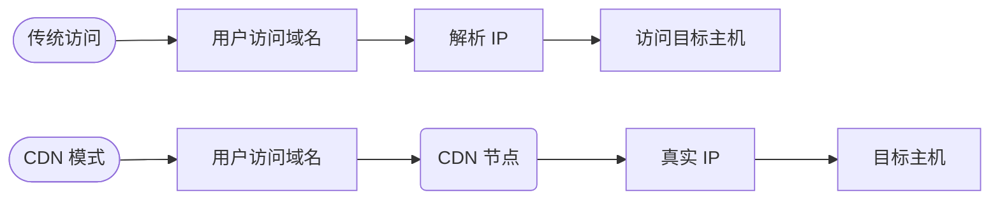

## 旁注、跨库

**旁注**：旁站注入，主站难以找到突破口，采用旁站间接的方式，来进行渗透。

http://192.168.190.128/bluecms/uploads/ad_js.php?ad_id=-1

> 序号一般默认是正数开始，用负数 `-1` 去查询会导致查询不到，显示其他列的数据

## CDN 绕过

**CDN** Content Deliver Network，内容分发网络，把网站放置在多个地方的服务器上，加速用户访问网站速度。

### 域名解析过程

### 检测网站是否存在 CDN

1️⃣ 方式一：多地 ping，如果 ping 到多个 IP 地址，说明网站存在 CDN，使用下面工具：

1. https://wepcc.com
2. http://ping.chinaz.com
3. https://mping.chinaz.com/
4. http://ping.aizhan.com/
5. http://tcping8.com/ping/

2️⃣方式二：`nslookup` 命令，如果用 `nslookup` 命令得到多个 IP 地址，那么存在 CDN。

### 查找真实 IP

1️⃣ 方式一：查询历史 DNS 记录

1. DNS 查询：https://www.malapan.com/dnshistory/safepub.com
2. https://www.racent.com/dns-check
3. 微步在线：https://x.threatbook.cn/
4. 在线域名信息查询：http://toolbar.netcraft.com/site_report?url=
5. DNS、IP 等查询：http://viewdns.info/ 
6. CDN查询 IP：https://tools.ipip.net/cdn.php

> 通过历史 DNS 追溯到最初的真实 IP 地址

2️⃣ 方式二：子域名查询

1. 第三方接口：
   1. https://x.threatbook.cn/
   2. https://dnsdb.io/zh-cn/
   3. https://site.ip138.com/
2. Google 语法： `site:baidu.com`
3. 子域名扫描器：subdomainbrute、amass、OneForAll 子域名挖掘机等等

> 网站对主要的、高流量的域名做 CDN，而子域名则没有。通过得到子域名的 IP 间接获得目标域名的真实 IP。

3️⃣ 空间网络测绘

> **网络空间测绘是一种技术手段，用于分析和可视化网络空间的结构和行为**。这种方法通常涉及以下几个方面：
>
> 1. **网络结构分析**：研究网络的物理结构和逻辑结构，包括网络节点（如服务器、路由器等）的分布、连接方式和网络拓扑。
>
> 2. **流量分析**：监测和分析网络流量，以识别数据流动的模式、流量峰值和可能的异常行为。
>
> 3. **安全态势感知**：通过网络空间测绘，可以识别潜在的安全威胁，如未授权的访问、恶意软件传播等。
>
> 4. **服务与应用映射**：识别网络上运行的各种服务和应用程序，了解它们的使用情况和相互关系。
>
> 5. **数据可视化**：将收集到的数据以图形化的方式展示出来，使得网络管理员和安全专家能够直观地理解网络的状态和潜在问题。
>
> 网络空间测绘的目标是提供一个全面的网络空间视图，帮助组织更好地理解和管理他们的网络环境，提高网络安全和效率。这种技术在网络管理、安全防护和研究领域有着广泛的应用。

1. Shadan：https://www.shodan.io/
2. Fofa：https://fofa.info/
3. hunter：https://hunter.qianxin.com/
4. zoomeye：https://www.zoomeye.org

> 网络空间测绘很多时候会收集域名及其关键词，可能包含真实 IP 地址。

4️⃣ 利用网站漏洞

- phpinfo 之类的探针
- GitHub 信息泄露
- XSS 盲打
- 命令执行反弹 shell
- SSRF
- ……

5️⃣ 利用邮件服务器

- 一些小型公司会把邮件服务器和业务服务器放置在一起

6️⃣ 通过分析目标 C 段来推断真实 IP 地址

