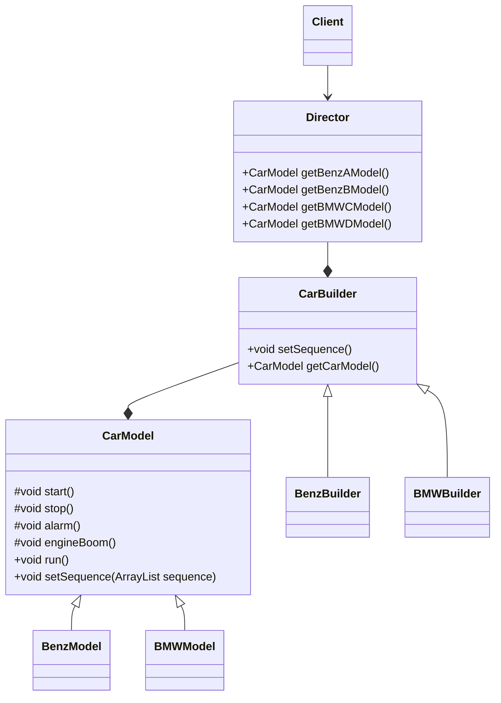

## 定义与特点
建造者模式的定义：*又称为“生成器模式”，指将一个复杂对象的构建和它的表现分离，使同样的构建过程可以有不同表现。*

优点：
- 封装性好，构建和表现分离
- 扩展性好，各个具体的建造者相互独立，有利于系统的解耦
- 客户端不必知道产品内部组成的细节，建造者可以对创建过程逐步细化，而不对其他模块产生影响，便于控制细节风险。

缺点：
- 产品的组成部分必须相同，这限制了其使用范围
- 如果产品的内部变化复杂，则建造者也要同步修改，后期维护成本大

建造者模式和工厂模式的关注点不同：
工厂模式注重零部件的生产，而**建造者注重零部件的组合**，两者可以结合使用。

## 模式结构
建造者模式的主要角色如下：
1. 产品角色（Product）：*包含多个组成部件的复杂对象*
2. 抽象建造者（Builder）：*包含创建产品各个子部件的抽象方法的接口*
3. 具体建造者（Concreate Builder）：*实现Builder接口，完成复杂产品的各个部件的具体创建方法*
4. 指挥者（Director）：*调用创建者对象中的部件构造与装配方法完成复杂对象的创建，在指挥者中不涉及具体产品的信息。*

## 实例



- CarModel
```java
package com.cap.creationalpatterns.builderpattern;

import java.util.ArrayList;

abstract class CarModel {
    private ArrayList<String> sequence = new ArrayList<>();

    // 启动
    protected abstract void start();

    // 停止
    protected abstract void stop();

    // 喇叭
    protected abstract void alarm();

    // 引擎声音
    protected abstract void engineBoom();

    final public void run() {
        for (String actionName : sequence) {
            switch (actionName.toLowerCase()) {
                case "start":
                    start();
                    break;
                case "stop":
                    stop();
                    break;
                case "alarm":
                    alarm();
                    break;
                case "engine boom":
                    engineBoom();
                    break;
            }
        }
    }

    final public void setSequence(ArrayList<String> sequence) {
        this.sequence = sequence;
    }
}

```
- BenzModel和BMWModel

```java
package com.cap.creationalpatterns.builderpattern;

class BenzModel extends CarModel {

    @Override
    protected void start() {
        System.out.println("new BenzModel().start()");
    }

    @Override
    protected void stop() {
        System.out.println("new BenzModel().stop()");
    }

    @Override
    protected void alarm() {
        System.out.println("new BenzModel().alarm()");
    }

    @Override
    protected void engineBoom() {
        System.out.println("new BenzMode().eingineBoom()");
    }
}
```

```java
package com.cap.creationalpatterns.builderpattern;

class BMWModel extends CarModel {

    @Override
    protected void start() {
        System.out.println("new BMWModel().start()");
    }

    @Override
    protected void stop() {
        System.out.println("new BMWModel().stop()");
    }

    @Override
    protected void alarm() {
        System.out.println("new BMWModel().alarm()");
    }

    @Override
    protected void engineBoom() {
        System.out.println("new BMWModel().eingineBoom()");
    }
}

```

- CarBuilder

```java
package com.cap.creationalpatterns.builderpattern;

import java.util.ArrayList;

public abstract class CarBuilder {
    // 建造一个模型，你要给我一个顺序要求，就是组装顺序
    public abstract void setSequence(ArrayList<String> sequence);
    // 设置完毕顺序后，就可以直接拿到这个车辆模型
    public abstract CarModel getCarModel();
}

```
- `BenzBuilder`和`BMWBuilder`

```java
package com.cap.creationalpatterns.builderpattern;

import java.util.ArrayList;

public class BenzBuilder  extends CarBuilder{
    private BenzModel benz = new BenzModel();

    @Override
    public void setSequence(ArrayList<String> sequence) {
        benz.setSequence(sequence);
    }

    @Override
    public CarModel getCarModel() {
        return benz;
    }
}
```

```java
package com.cap.creationalpatterns.builderpattern;

import java.util.ArrayList;

public class BMWBuilder extends CarBuilder{
    private BMWModel bmw = new BMWModel();

    @Override
    public void setSequence(ArrayList<String> sequence) {
        bmw.setSequence(sequence);
    }

    @Override
    public CarModel getCarModel() {
        return bmw;
    }
}
```

- `Director`

```java
package com.cap.creationalpatterns.builderpattern;

import java.util.ArrayList;

public class Director {
    private ArrayList<String> sequence = new ArrayList<>();
    private BenzBuilder benzBuilder = new BenzBuilder();
    private BMWBuilder bmwBuilder = new BMWBuilder();

    public BenzModel getABenzModel() {
        this.sequence.clear();
        this.sequence.add("start");
        this.sequence.add("stop");
        this.benzBuilder.setSequence(this.sequence);
        return (BenzModel)this.benzBuilder.getCarModel();
    }

    public BenzModel getBBenzModel(){
        this.sequence.clear();
        this.sequence.add("engine boom");
        this.sequence.add("start");
        this.sequence.add("stop");
        this.benzBuilder.setSequence(this.sequence);
        return (BenzModel) this.benzBuilder.getCarModel();
    }

    public BMWModel getCBMWModel(){
        this.sequence.clear();
        this.sequence.add("alarm");
        this.sequence.add("start");
        this.sequence.add("stop");
        this.bmwBuilder.setSequence(this.sequence);
        return (BMWModel) this.bmwBuilder.getCarModel();
    }

    public BMWModel getDBMWModel(){
        this.sequence.clear();
        this.sequence.add("start");
        this.bmwBuilder.setSequence(this.sequence);
        return (BMWModel) this.bmwBuilder.getCarModel();
    }

}
```

测试：
```java
package com.cap.creationalpatterns.builderpattern;


import org.junit.Test;

import java.util.ArrayList;
import java.util.stream.IntStream;

/**
 * @author Penggeor
 */
public class BuilderPatternTest {
    /**
     * 没有建造者模式下情况下：
     * 生产一个奔驰模型
     * 要求跑的时候，先发动引擎，然后再挂挡启动，然后停下来，不需要喇叭
     */
    @Test
    public void test(){
        BenzModel benzModel = new BenzModel();
        ArrayList<String> sequence = new ArrayList<>();
        sequence.add("engine boom");
        sequence.add("start");
        sequence.add("stop");
        benzModel.setSequence(sequence);
        benzModel.run();
    }

    /**
     * 没有建造者模式下需要手动一个个去设置其顺序，非常麻烦
     * 使用建造者模式：
     */
    @Test
    public void test1(){
        ArrayList<String> sequence = new ArrayList<>();
        sequence.add("engine boom");
        sequence.add("start");
        sequence.add("stop");

        // 要一个奔驰车
        BenzBuilder benzBuilder = new BenzBuilder();
        benzBuilder.setSequence(sequence);
        BenzModel benz = (BenzModel) benzBuilder.getCarModel();
        benz.run();
    }

    /**
     * 在建造者模式下，再使用指挥者
     * 可以直接生产预先定义好的顺序：
     */
    @Test
    public void test2() {
        Director director = new Director();

        // 1万辆A类型的奔驰车
        IntStream.range(0, 10_000)
                .forEach(v -> {
                    director.getABenzModel().run();
                });

        // 100万辆B类型的奔驰吃
        IntStream.range(0, 1_000_000)
                .forEach( v -> {
                    director.getBBenzModel();
                });


        // 1000万辆C类型的宝马
        IntStream.range(0, 10_000_000)
                .forEach( v -> {
                    director.getCBMWModel();
                });

    }

}
```

## 参考
1. [菜鸟教程-建造者模式](https://www.runoob.com/design-pattern/builder-pattern.html)
2. [C语言中文网-建造者模式](http://c.biancheng.net/view/1354.html)
3. 《设计模式之禅》秦小波
4. 《大话设计模式》程杰
